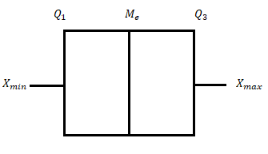
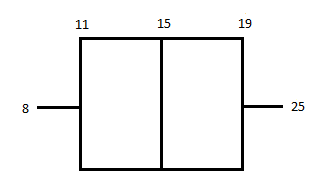
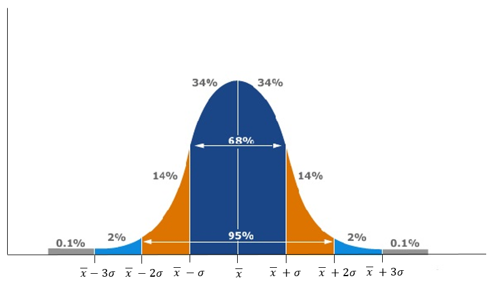
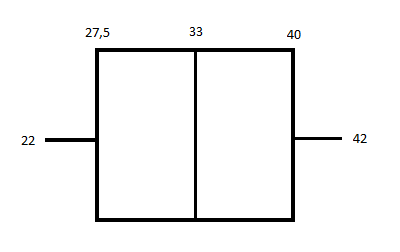

..
  Дескриптивна статистика
  reading

=======================
Дескриптивна статистика
======================= 

.. infonote:: **Појмови које ћеш научити су:**
  
  - дескриптивна статистика
  - средња вредност
  - медијана
  - мод
  - кутијасти дијаграм
  - стандардна девијација, варијанса
  - нормална расподела

    
Дескриптивна статистика
-----------------------

Као што је већ речено у претходној лекцији статистика је научни метод који се примењује са сврхом 
описивања, процене и анализе неке карактеристике друштва. Она представља грану математике која 
прикупља, анализира, тумачи, обрађује и приказује податаке чија је основна карактеристика 
варијабилност. 

У претходној лекцији навели смо које су то две врсте статистике, а у овој ћеш учити о 
дескриптивној статистици.

Важна примена дескриптивне статистике је да сумира сакупљене податке на јасан и разумљив начин. 
Примењује се како би описали основна својства података који се анализирају. 
Заједно са једноставним графичким приказом, она даје и основну квантитативну анализу података.

Средња вредност
---------------

Средња вредност или аритметичка средина представља суму свих података подељену са 
укупним бројем података. Означава се  са 

:math:`\overline {x}`.

Aко обележја :math:`x_1, x_2, ... , x_n` имају фреквенције редом: 
:math:`f_1, f_2, ... ,f_n`, онда је:

:math:`\overline {x} = \frac{x_1 \cdot f_1+x_2 \cdot f_2+...+x_n \cdot f_n}{f_1+f_2+...+f_n}`

**Пример 1.** 
На контролној вежби из математике ученици добили су 3 јединице, 7 двојки, 10 тројки, 
7 четворки и 5 петица. Колика је средња оцена одељења на овој вежби? 

*Решење:*

:math:`\overline {x} = \frac{3 \cdot 1+7 \cdot 2+10 \cdot 3+7 \cdot 4+5 \cdot 5}{3+7+10+7+5} \overline {x} = \frac{100}{32}=3,125`

У статистичком истраживању ово је једна од најважнијих нумеричких карактеристика испитиваног обележја, одмах након ње по значају налази се медијана.

Медијана
--------

Медијана je вредност средишњег податка која податке поређане по величини, почевши од најмањег 
до највећег, дели у два једнако бројна дела. Ако је број података непаран медијана је 
вредност средишњег податка, а ако је број података паран медијана представља средњу 
вриједност два средишња податка. Означава се  са :math:`М_е`.

Медијана дели уређени низ података на два једнакобројна низа. Медијан прве половине 
низа је доњи (први), квартал и означава се са :math:`Q_1`. Медијан друге половине 
низа назива се горњи (трећи), квартал и означавамо га са :math:`Q_3`. 
Из овога произилази да медијану такође називамо и други квартал и такође је 
можемо означавати и са :math:`Q_2`.

**Пример 2.** У следећем низу одреди први, други и трећи квартал.
Низ: 7, 9, 10, 10, 12, 14, 15, 15, 16, 17, 18.

*Решење:*

:math:`Q_2 = 14` (медијана)

Низ мањи од медијане је: 7, 9, 10, 10, 12. Први квартал представља медијану овог низа.
:math:`Q_1 = 10`

Низ већи од медијане је: 15, 15, 16, 17, 18. Трећи квартал представља медијану овог низа.
:math:`Q_3 = 16`

Из овог примера можеш да видиш да медијана дели низ података на четири једнака дела. 
У овом примеру ти делови би били: 7, 9 затим 10, 12 затим 15, 15 затим 17, 18.

Медијана није осетљива на екстремне вредности. Већина особина код људи је распоређена 
по нормалној расподели. Екстремне вредности се налазе на једном од два краја и 
захватају мали проценат резултата. Померање резултата ка крајевима дистрибуције 
не мења проценат резултата изнад и испод медијане. Због тога је медијана добра мера 
централне тенденције код изразито закривљених дистрибуција.

Мод
---

Мод је вредност податка који се најчешће понавља (има нејвећу фреквенцију). 
Означава се  са :math:`М_о`. Уколико се два податка појављују два пута у скупу оне 
је бимодалан. Фреквенција мода се одређује тако што након одређивања мода пребројимо 
колико пута се тај елемент понавља у низу.

**Пример 3.** Одредити мод низа, као и његову фреквенцију.

Низ: 3, 5 ,5 ,7 ,11 ,11 ,11, 13, 15.

:math:`М_о=11`

Фреквенција мода је 3.

**Пример 4.** Одредити мод низа, као и његову фреквенцију.
Низ: 3, 5 ,6 ,7 ,10 ,11, 13, 15, 17, 20.

Овај низ нема мод. Као што видиш и та могућност постоји!

**Пример 5.** Одредити мод низа, као и његову фреквенцију.
Низ: 7, 9, 10, 10, 10, 12, 14, 15, 15, 15, 16 16, 17, 18.

Овај низ је бимодалан. 
Мод: 10 и 15,
Фреквенција: 3.

Кутијасти дијаграм
------------------

Уколико узмемо за пример аритметичку средину оцена ученика у једном одељењу која износи 3, 
долазимо до више могућих распореда оцена. Једна је да цело одељење има оцену 3 их предмета 
у питању, али такође случај може бити да половина има оцену 5, а половина оцену 1.

Ако скуп података желимо да представимо прецизније него што то чини аритметичка средина 
употребићемо кутијасти дијаграм. На њему се налази пет различитих података: 
минимална вредност података :math:`X_{min}`, максимална вредност података :math:`X_{max}`, 
први квартал $Q_1$, медијана :math:`M_e` и трећи квартал :math:`Q_1`. 

**Пример 6.** Нацртати кутијасти дијаграм за дат низ.
Низ: 8, 10, 12, 13, 15, 16, 18, 20, 25.

За почетак ћемо одредити неопходне податке.

:math:`X_{min} = 8`
:math:`X_{max} = 25`
:math:`Q_1 = 11`
:math:`M_e = 15`
:math:`Q_3 = 19`

Сада када смо одредили неопходне вредности можемо нацртати кутијасти дијаграм овог низа:

Стандардна девијација
---------------------

Расподела података око њихове аритметичке средине меримо одступањима појединиачних података 
од те средине. За укупну меру не можемо узети број тих одступања јер би се одступања с 
различитих страна међусобно поништавала (одступање оцене 1 од просека 3 износи :math:`1–3=-2`,
а оцине 5 износи :math:`5-3=2`, па је збир одступања :math:`2–2=0`). 
Због овога ми узимамо квадрате тих одступања, како би резултат увек био позитиван 
(одступање оцене 1 од просека 3 износи :math:`(1–3)^2=4`. а оцине 5 износи 
:math:`(5-3)^2=4`, па је збир квадрата ових одступања :math:`4+4=8`)

Стандардну девијацију можемо да интерпретирамо као просечно одступање свих 
нумеричких података од њихове аритметичке средине. 
Самим тим закључујемо да што је она мања то су подаци ближи аритметичкој средини.

Стандардна девијација представља други корен из варијансе. Варијанса је мера расподеле 
података око аритметичке средине, дефинише се као просечно квадратно одступање од просека:

:math:`\sigma}^2 = \frac{(x_1 - \overline {x})^2 + (x_2 - \overline {x})^2 + ... + (x_n - \overline {x})^2}{n}`

Из овога произилази да је стандардна девијација:

:math:`{\sigma} = \sqrt {\frac{(x_1 - \overline {x})^2 + (x_2 - \overline {x})^2 + ... + (x_n - \overline {x})^2}{n}}`

**Пример 7.** Одреди стандардну девијацију за следећи низ.
Низ: 10, 12, 13, 15, 17, 18.

*Решење:*

:math:`\overline {x} = \frac{10+12+13+15+17+18}{6}\overline {x} =14`

:math:`\sigma} = \sqrt {\frac{(10 - 14)^2 + (12 - 14)^2 + (13 - 14)^2 + (15 - 14)^2 + (17 - 14)^2 + (18 - 14)^2}{6}}`

:math:`\sigma} = \sqrt {\frac{23}{3}}=2,77`

Добијен резултат нам показује да дати подаци одступају од аритметичке средине за 2,77.

Нормална расподела
------------------

Ако је податак о популацији (нпр. висина ученика у средњим школама) резултат многих 
међусобно независних утицаја (нпр. прехране, висине родитеља...), онда је хистограм 
релативних фреквенција тог податка увиек потпуно одређен његовом аритметичком 
средином :math:`\overline {x} $ и стандардном девијацијом $ {\sigma}`. 

Има облик звона. Симетрична је у односу на праву :math:`x = \overline {x}`, 
kао код сваке симетричне криве аритметичка средина, модус и медијана су међусобно једнаки. 
X-оса је и са леве и са десне стране асимптота oве функције. :math:`\sigma` 
јој одредује ширину распршења око :math:`\overline {x}` на следећи начин:

Питалице за крај:
-----------------

.. mchoice:: question11278
      :correct: b
      :answer_a: 101
      :answer_b: 102
      :answer_c: 103
      :feedback_a: Нетачно
      :feedback_b: Тачно
      :feedback_c: Нетачно
      
      Тони посљедњих седам дана мери број откуцаја срца након вежбања. 
      Податке је поређао по величини: 98, 101, 101, 102, 103, 106, 110.
      Која је медијана записаних података:

.. mchoice:: question1127890
      :correct: c
      :answer_a: :math:`\overline {x}`
      :answer_b: :math:`Q_1`
      :answer_c: :math:`M_e`
      :feedback_a: Нетачно
      :feedback_b: Нетачно
      :feedback_c: Тачно
      
      Кутијастим дијаграмом су приказани подаци. У складу са тим одговори на питања.

.. mchoice:: question11277812
      :correct: c
      :answer_a: Мод
      :answer_b: Медијана
      :answer_c: Аритметичка средина
      :feedback_a: Нетачно
      :feedback_b: Нетачно
      :feedback_c: Тачно
      
      Ученици једнога разреда анкетирани су о броју деце у њиховој породици . 
      Ово су њихови одговори: 1, 1, 2, 2, 2, 2. 2, 2, 2. 2. 2, 2, 2, 2, 2, 2, 2, 2, 3, 3, 4, 4, 6, 7.
      *Шта бисте употребили како би приказали просечан број деце у породици:*

.. mchoice:: question112778765
      :correct: а
      :answer_a: 68,2
      :answer_b: 95,4
      :answer_c: 34,1
      :feedback_a: Тачно
      :feedback_b: Нетачно
      :feedback_c: Нетачно
      
      Просечан број бодова које су постигли ученици на испитивању износи 142 бода, а стандардна девијација 7.
      Колико посто ученика има 135 - 149 бодова:

.. mchoice:: question112234
      :correct: а
      :answer_a: 68,2
      :answer_b: 47,7
      :answer_c: 34,1
      :feedback_a: Тачно
      :feedback_b: Нетачно
      :feedback_c: Нетачно
      
      Ако је просечна висина ученица 165 cm, а њихова стандардна девијација 5 cm:
      Oдреди колико је посто ученица високо 160 - 170 cm:

