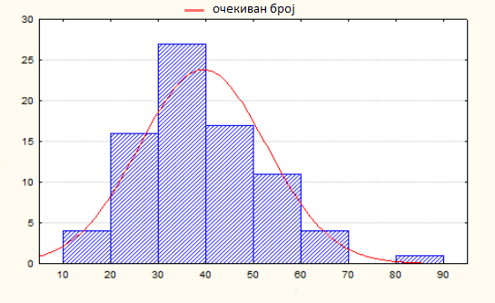

# Примена података и елементарне дескриптивне статистике

Област примене статистике се проширила, и не постоји област људске делатности у којој се не примењује, у већој или мањој мери. Статистика има примену у следећим областима: метеорологија, медицина, биологија, економија, психологија, спорт, политка,...

Помоћу разних метода долазимо до података који могу да у свим сферама промене људски живот. Задаци статистике су да открије важне карактеристике посматраних појава, повезаност са другим појавама, узроке и последице њиховог стања и промена, као и законитости које произилазе из ових информација. На овај начин имамо јаснију слику о неком стању, свест, и самим тим могућност да уведемо промену.

Тестирање статистичких хипотеза је вид статистичког закључивања који се примењује у ситуацијама када се унапред претпоставља постојање одређене везе међу изучаваним појавама. Статистичка хипотеза је свака претпоставка која се односи на расподелу обележја, може бити тачна или нетачна.

Статистика вам омогућава да у свакодневном животу лакше доносите одлуке, попут тога шта ћете обући или колико новца треба да понесете како бисте ручали у одређеном ресторану. Затим, израчунавање колико је времена потребно да се стигне на одређено место, што вам даје могућност да одаберете најбољу руту, као и колико ћете се тамо задржати. Дакле олакшава свакодневни живот појединца.

## Примена дескриптивне статистике у медицини

Када је у питању медицина од значаја су подаци попут средње вредности, највећи и најмањи елемент скупа, и стандарадно одступање од аритметичке средине.

На хистограму можемо видети фреквенцију (заступљеност) доба старости по одређеним категоријама.

У медицини се осим оваквог хистограма могу употребљавати и табеле, кутијасти дијаграми, линијску дијаграми...

Како би открили нову болест служимо се статистиком. Овако можемо проценити број оболелих од ове болести. Поред тога, то нам омогућава да избројимо број смртних случајева узрокованих том болешћу.

## Употреба статистике у политици

Сврха статистике у политици је од значаја за доношење одлука о здравству, демографији, образовању... Прикупљени подаци из ових области помажу да држава формира план, упореди стање државе... Ако земља показује пад или недостатак у било ком сектору, влада ће предузети одговарајуће мере.

## Статистика у временској прогнози

Времена прогноза подразумева предвиђање временских прилика и неприлика у току неког временског периода, углавном зависи од употребе статистике. Различити стручњаци се служе статистичким методама, прикупљање и тумаче податке са циљем да предвиде временске прилике.

Помоћу статистике можемо предвидети било коју природну катастрофу која се може десити у блиској будућности. На овај начин у случају ванредне ситуације смо у приправности и смањујемо фактор ризика који се односи на одређену хитну ситуацију.

## Статистика и спорт 

Сваки спорт обично захтева употребу статистике да би се побољшала његова ефикасност, осим тога она је заправо веома важан алат за разумевање спорта. Помаже нам да меримо и упоредимо различите играче и тимове и да видимо како се понашају у различитим околностима. На пример, статистика нам може рећи колико је голова играч постигао, или колико је прекршаја направио. Такође, може рећи који су играчи најуспешнији када играју против одређених тимова, или на одређеним стадионима. Дакле, помоћу ње можемо дубље разумети сва дешавања игре. Са друге стране, осим за гледаоце, статистика је драгоцено средство за спортске тимове и играче јер им помаже да побољшају разумевање својих перформанси у спорту.

Поред њених предности, можемо уочити и неке мане. Постоји неколико недостатака ако се превише ослањате на статистику. Као прво, статистика може бити погрешна. Мала величина узорака може довести до непрецизних резултата, као што може и да дође до грешке у тумачењу. Поред тога, статистика не узима увек у обзир појединачне случајеве, него гледа већу слику, што доводи до тога да она понекад нема велики значај за самог појединца.
