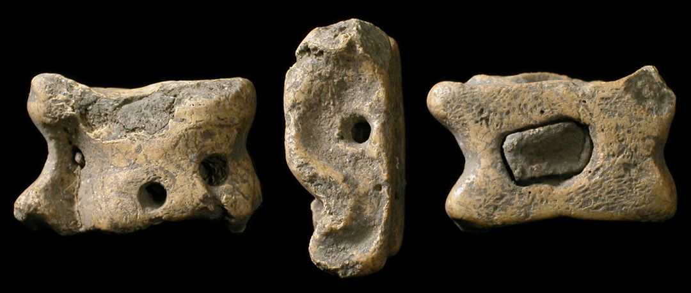
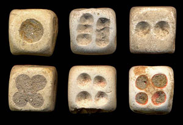
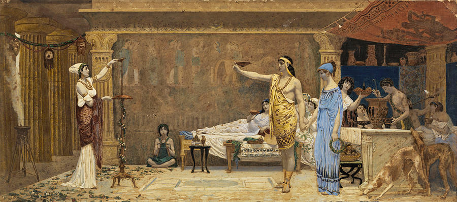
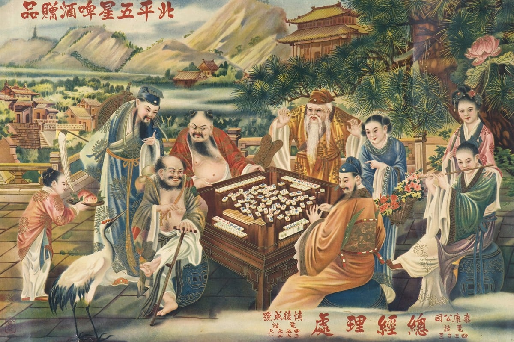
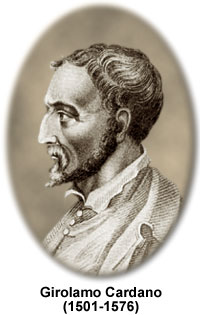
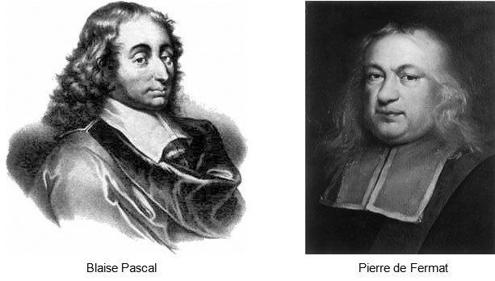

..
  Кратка историја вероватноће
  reading

=========================
Вероватноћа кроз историју
=========================

.. infonote:: **У овој лекцији ћеш научити:**

  Појмови које ћеш научити су:

  - Развиће вероватноће теком историје
  - Рану историју примене вероватноће
  - Модерну теорију вероватноће

   
Вероватноћа је грана математике са јако богатом и дугом историјом.Вероватноћа је концепт који се 
користи за мерење неизвесност.Она је од суштинске важности у многим областима као што су:
математика, физика, статистика, економија итд... Њени корени се могу пратити још од Времена
древних цивилизација где је она коришћена у разним играма и коцкарским праксама, док се касније 
није развила у формалну математичку дисциплину.

Рана историја вероватноће - Игре на шансу
-----------------------------------------

Од самог почетка цивилизације, постојала је потреба за различитим облицима забаве.
Један такав облик биле су игре случаја. Овакве игре су, поред пружања бега од реалности, 
биле изванредан извор узбућења и фасцинације. у овој глави ћеш проћи кроз велику и зарноврсну
историју игри на шансу, које ће касније представљати основу за изучавање вероватноће као засебне
гране математике.

Древна Месопотамија - Почеци игри на шансу
------------------------------------------

Колевка цивилизације је истовремено и колевка игри случаја. Најранији почеци око 3000. године
пре н. е. су забележени на овим просторима. Људи овог региона су користили зарличите методе
за тумачење намера богова. Па је тако бацање обележених штапова, каменчића , костију... постала 
честа пракса, и то је омогућавало појединцима да пронађу вођство од богова у свакодневним одлукама
или пак неким тежим питањима.Овај рани облик је поставио темеље за даље развијање оваквих игара.

Долазак Коцкица
---------------

Долазак коцкица обележава значајан преокрет у историји играра случаја. 
Сматра се да су оне први 
пут употребљиване у Египту око 2000 год. пре н. е. и брзо су стекле популарност широм свих древних цивилизација
Почетно су израђицане од костију, слоноваче или дрвета, и разликовали су се облици(а не тачкице). Бацале су се како би се одредили исходи у коцкању или рекреативним активностима.
Игре са коцкама су се касније прошириле на древну Грчку, Рим, Кину и Индију.

Стара Грчка и Рим
-----------------

За разлику од Египта и Местопотамије игре случаја у Старој Грчкој и Риму нису само биле облик забаве, већ су се дубоко укорениле у друштву. Грци су измислили игре као што су: Кубеија и Коттабос, док су казина, то јест **клеротерија** су процветала у Риму где су људи долазили да окушају своју срећу у разним облицима коцкања.

.. figure:: ../../_images/kleroteria.jpg
        :width: 450px   
        :align: center

Азијски утицај: Маџонг и др.
----------------------------

Помоћу трговине међу собом игре случаја су путовале преко континената и тако су постајале доступне свима. Маџонг, који потиче из Кине токо династије Ћинг, представљао је спој вештине и случаја у традиционалним играма. Комбинујући елементе стратегије и среће маџонг се брзо проширио на остале делове Азије постајући све популарнији.Постоје и друге Азијске игре као што су: Пачинка у Јапану и Шушен у Кореји се играју и дан данас.

Вероватноћа као засебна наука
-----------------------------

Најстарија употреба вероватноће као математичке дисциплине је забележена као криптографске поруке од стране Арапских математичара око 8. - 13. века н. е. Ово је био безбедан начин међусобне комуникације где би пошиљалац написао поруку у криптографским знација, а прималац би имао кључ који би користио вероватноћу помоћу којег би он могао да дешифрује ту поруку.

Такође  сматра се да је арапски филозов Ал Кинди био први који је искористио **статистички закључак**.

Кардано и концепт вероватноће
-----------------------------

Један од најранијих доприносилаца развоју вероватноће био је италиојански математичар, лекар и астролог Ђероламо Кардано. Он је објавио књигу под називом "Liber de Ludo ALeae" (Књига о играма на срећу) 1564. године где је истраживао математику коцкања.Увео је концепт очекиване вредности где је увидео да се исходи могу проценити на основу вероватноће њиховог појављивања.Такође је исрачунао вероватноћу бацања коцке и разумео је најосновније концепте вероватноће као што jе нпр. релативна фреквенција.

Пионири модерне теорије вероватноће
-----------------------------------

Први најпознатији пример употребе вероватноће потиче из 17. века и везан је за писмо измљђу
2 математичара: Блеза Паскала и његовог пријатеља Пјера де Фермата.Наиме они су били заинтересовани за решавање проблема које је поставио њихов пријатељ Антоан Гомбо, витез од Мере (франц. Antoine Gombaud, Chevalier de Méré )који је хтео да унапреди своје добитке у коцкарским играма. Наиме поставио је 2 питања и то:

1. Колико пута је потребно да се баци пар коцки да би шанса да се добије дупла шестица    била   бар 50%?

2. Како да се добици распореде праведно ако је игра на срећу прекинута пре њеног закључка?

Паскар и Фeрмат су размењивали писма радећи на овом проблему, што је довело до основних принципа вероватноће:

- Паскал је приметио да вероватноћа да се догоди одређени догађај може бити изражена као однос броја повољних ишода и броја могућих ишода. Он је развио концепт вероватноће као броја између 0 и 1, где је 0 представљало немогућност догађаја, а 1 сигурност догађаја. Овај концепт је био револуционаран и отворио је врата за даље истраживање вероватноће.

- Фермат је допринео разумевању вероватноће уводећи концепти комбинаторике и размишљајући о проблемима са више корака. Он је такође приметио да се вероватноћа догађаја може израчунати помоћу различитих метода, као што је биномна дистрибуција. Његови доприноси су додатно проширили област вероватноће и отворили пут за даље истраживање

Током 18. и 19. века, теорија вероватноће доживела је даљи развој захваљујући радовима математичара као што су Абрахам де Моaвре, Пјер Симон Лаплас и Карл Фридрих Гаус. Де Моaвре је познат по својој раду на нормалној расподели и теорији узорака, док је Лаплас развио своју познату Лапласову расподелу вероватноће. Гаус, један од најпознатијих математичара свих времена, дао је важне доприносе теорији вероватноће кроз свој рад на нормалној расподели и методима апроксимације.

Током 20. века, теорија вероватноће постала је значајан део математике и статистике. Руски математичар Андреј Колмогоров формулисао је аксиомске основе модерне теорије вероватноће. Његове основе, које су објављене 1933. године, пружиле су ригорозну математичку основу за проучавање вероватноће.

.. figure:: ../../_images/kolmogorov.jpg
        :width: 450px   
        :align: center

Паралелно с математичким развојем, вероватноћа је такође постала важан концепт у статистици. Статистика се бави сакупљањем, анализом и интерпретацијом података и вероватноћа има кључну улогу у овим процесима. Вероватноћа се користи за израчунавање вероватности различитих резултата, као и за тестирање хипотеза и доношење закључака на основу података.

Данас се теорија вероватноће примењује у различитим областима, укључујући математику, статистику, физику, економију, рачунарство и друге науке. Вероватноћа је кључна у моделирању случајних процеса и доношењу рационалних одлука у неизвесним ситуацијама.

Занимљивости:
~~~~~~~~~~~~~

1. Како играти Маџонг: `линк  1 <https://youtu.be/qpYF-xmNMew>`_

2. Kако ради клеротерија: `линк 2 <https://youtu.be/PbAMAMXCUqU>`_

3. Све о проблему Паскала и Фермата: `линк 3 <https://youtu.be/W5XbuQq65Xc>`_

Питања:
-------

.. quizq:: 

   .. mchoice:: question41011
      :correct: b
      :answer_a: из Египта
      :answer_b: из Месопотамије
      :answer_c: из Старе Грчке
      :feedback_a: Нетачно
      :feedback_b: Тачно
      :feedback_c: Нетачно
      
      Одакле потичу најстарије игре на вероватноћу?

.. quizq:: 

   .. mchoice:: question410112
      :correct: a
      :answer_a: 2000. год. пре н. е.
      :answer_b: 2000. год
      :answer_c: 1564. год.
      :feedback_a: Тачно
      :feedback_b: Нетачно
      :feedback_c: Нетачно
      
      Које године су се први пут употребиле коцкице у играма на срећу:

.. quizq:: 

   .. mchoice:: question41011290
      :correct: a
      :answer_a: из Кине
      :answer_b: из Јапана
      :answer_c: из Кореје
      :feedback_a: Тачно
      :feedback_b: Нетачно
      :feedback_c: Нетачно
      
      Одакле потиче игра Маџонг?

.. quizq:: 

   .. mchoice:: question4101129067
      :correct: b
      :answer_a: Ал Кинди
      :answer_b: Ђерлоамо Кардано
      :answer_c: Антоан Гомбо, витез од Мере
      :feedback_a: Нетачно
      :feedback_b: Тачно
      :feedback_c: Нетачно
      
      Ко је написао Књигу о играма на Срећу?

.. quizq:: 

   .. mchoice:: question4011256
      :multiple_answers:
      :correct: b,d
      :answer_a: Андреј Кoлмогоров
      :answer_b: Блез Пaскал
      :answer_c: Ђерлоамо Кардано
      :answer_d: Пјер де Фермат
      :feedback_a: Нетачно
      :feedback_b: Тачно
      :feedback_c: Нетачно
      :feedback_d: Тачно
      
      Који научници су пионири модерне теорије вероватноће:

 
 

