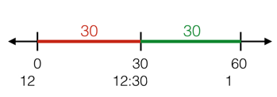
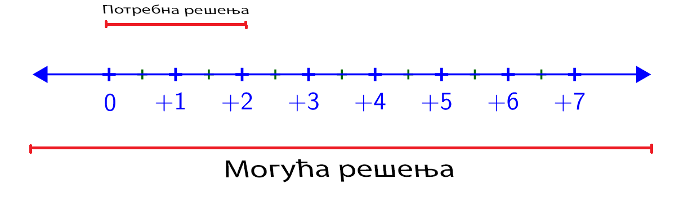
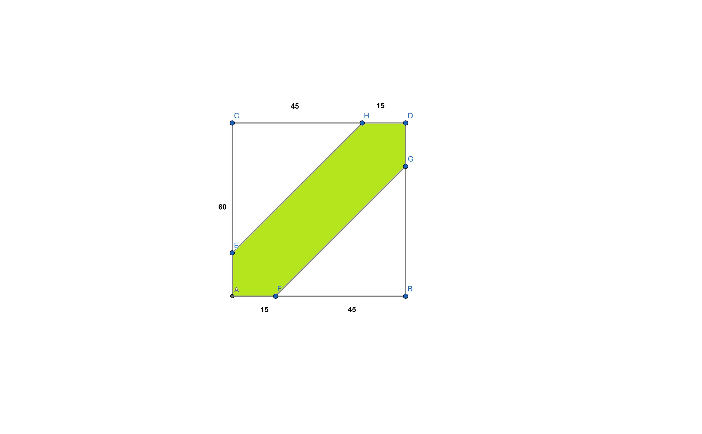
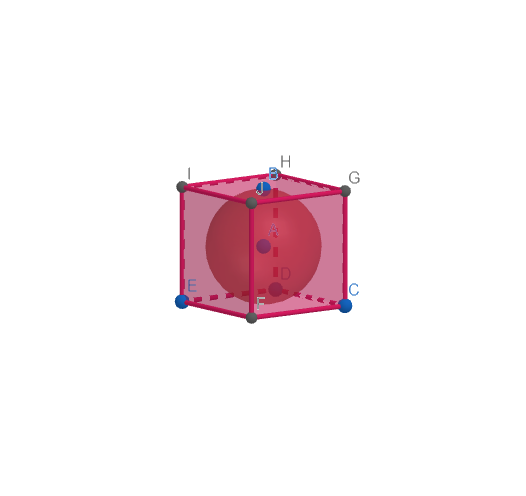
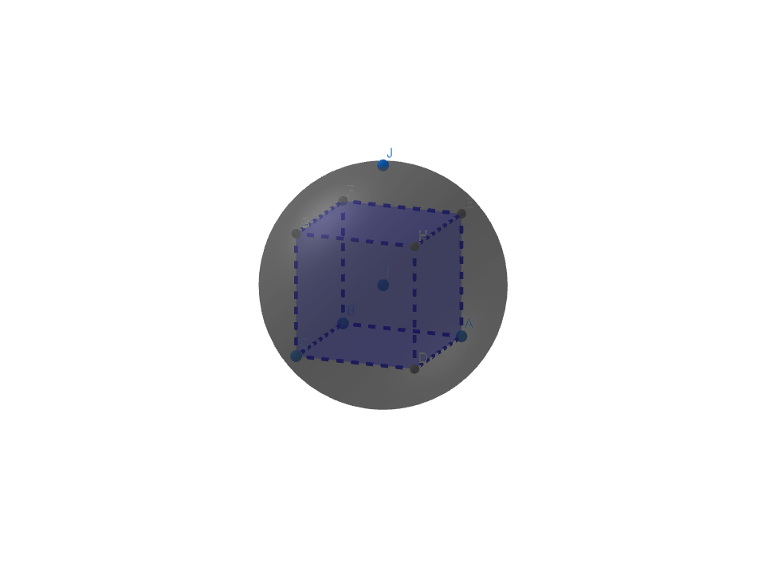

========================
Геометријска вероватноћа
========================

У овом делу ћеш научити још један начин рачунања вероватноће, 
овог пута израчунавање броја могућих решења биће рађено коришћењем 
геометријских појмова као што су: *дужина*, *површина* или *запремина*.

Геометријска вероватноћа је нарочито корисна код проблема са непрекидним бројем решења као нпр:

 

1. Аутобус ће доћи на станицу у неком тренутку између 12 и 1 сат. 
   Ако се појавиш у 12:30 колика је вероватноћа да ћеш стићи на аутобус?

 

Приказаћемо овај проблем геометријски преко бојевне праве.
Уочавамо да је дужина од 12:30 до 1 иста као од 12 до 12.30, па је решење :math:`\frac{1}{2}`.

У овоj лекцији проћи ћеш кроз *једнодимензионалне*, *дводимензионалне* и *тродимензионалне* 
примере.  
    

Једнодимензионална геометријска варијабилност
---------------------------------------------

   
Нека је x неки број од 0 до 7. Колика је вароватноћа да је x ближе 0 него 4?

Број решења овог задатка је бесконачан. Али са бројевне праве увиђамо да ће x бити ближе 2 
ако   **0<x<2**.

Сада искористимо дужине од могућих решења и убацимо их у регуларну формулу за вероватноћу:

P(x ближе 0 него 4) :math:`= \frac{дужинагде 0<x<2}{дужинагде 0<x<7} = \frac{2}{7} ≈ 28.5\%`

Суштина једнодимензионалне геометријске варијабилности је да користи бројевну праву на 
којој се "мере" решења користећи *дужину*.
  
  

Дводимензионална геометријска варијабилност 
-------------------------------------------

Наравно, јако мало проблема ће имати само једну променљиву. Зато за 2 променљиве се 
користи **Дводимензионална геометријска варијабилност**.
  
Како једнодимензионална варијабилност се користи дужином, дводимензионална варијабилност 
се користи **површином** геометријских фигура.

Па је тако формула за изачунавање задатака користећи ову методу:

:math:`x = \frac{Површина тражених решења}{Површина свих решења}`

Урадимо сада један пример користећи ново научену методу:

У квадрат странице a = 10 уписан је круг. Колике су шансе да ће се произвољна тачка наћи у кругу?

.. image:: ../../_images/2dprimer1.png
      :width: 500px   
      :align: center 

Уочавамо да је полупречник датог круга r = 5

Сада израчунајмо површине датих фигура:

:math:`P1(површина квадрата) = a^2 = 100`

Затим површину круга(P2)

:math:`P2 = r^2 \pi = 5^2 \pi = 25\pi`
    

Пошто се траши вероватноћа да тачка буде у кругу површина круга је сада наша "површина тражених решења".

Применимо нашу формулу:

:math:`X = \frac{25\pi}{100} ≈ 78\%`

Наравно нису сви проблеми наизглед геометријски. То не значи да се они не могу урадити на геометријску начин.  

Урадимо сада један такав пример:

Марко и Лука обојица долазе у школу у неком тренутку између 9 и 10 сати. 
Договорили су се да  чекају 15 минута ако се други не појави.
Колике су шансе да се Марко и Лука сретну?

Ово наизглед не личи на геометријски проблем, али можемо га лако претворити.

У овом задатку имамо 2 променљиве: Време кад Марко долази у школу 

(a) и време кад Лука долази у школу (b).

Самим тим ово можемо представити као квадрат странице 60 и сва могућа решења су тачке у том квадрату.

Међутим, Марко чека луку 15 мин. тако да, да би се срели лука мора доћи најкасније 15 мин после марка  

b < a+15

Исто тако, ако би лука дошао пре Марка чекао би га 15 минута тако да мора доћи исто најраније 15 мин пре Марка 

b > a-15

Када све то додамо у наш квадрат добијемо овакву фигуру:

Површина дате фигуре је: 

:math:`60^2 - \frac{45^2}{2} * 2 = 3600 - 2025 = 1575`

Површина квадрата је 60^2 = 3600

Применимо сад формулу:

:math:`x = \frac{1575}{3600} ≈ 44\%`

Тродимензионална геометријска варијабилност
-------------------------------------------

Ако се задаци са две променљиве раде помоћу дводимензионалне варијабилности, 
може се лако претпоставити да се Тродимензионална варијабилност ради са **три** променљиве.

Овог пута се уместо површине рачунају **запремине** датих тела и 
убацују се у врло сличну формулу која гласи:

:math:`x = \frac{запремина тражених решења}{запремина свих решења}`

 
Сада кад имамо све што нам треба, урадићемо пример врло сличан примеру из прошле главе 
само сада са 3 променљиве
 
У коцку странице a=10 уписана лопта полупречика 5.Колике су шансе да се произвољна тачка нађе у лопти.

Као што примећујемо број свих решења је запремина коцке која гласи 

:math:`V = a^3 = 1000`

Сада изачунајмо запремину лопте која ће бити број наших тражених решења.

 
:math:`V = \frac{4}{3} r^3\pi = \frac{4}{3}125\pi`

Примењујемо опет формулу:

:math:`x = \frac{\frac{4}{3}125\pi}{1000} = \frac{\frac{1570}{3}}{1000} ≈ 52\%`
  

Уrадимо сада један пример који наизглед није геометријски:
  

Изаберимо нека 3 броја из скупа [0,1]. Колике су шансе да збир њихових квадрата буде мањи од 1?

Најпре, пошто имамо 3 (a, b ,c) променљиве уочавамо да су сва решења садржана у коцки која обухвата скуп [0,1].

Дакле запремина дате коцке је  :math:`1^3 = 1`.

Затим имамо да је: :math:`a^2 + b^2 + c^2 < 1`

То је по геометријској формули лопта са полупречником 1, али пошто a, b, c ≥ 0 само $$ (\frac{1}{2})^3 = \frac{1}{8}$$ ове лопте заправо припада нашим решењима.

Па је површина наших тражених решења:

:math:`\frac{1}{8} \cdot (\frac{4\pi}{3} \cdot 1^3) = \frac{\pi}{6}`
   

Тако да:

:math:`x=\frac{\frac{\pi}{6}}{1}=\frac{\pi}{6}=52\%'

Задаци
------

.. quizq:: 

   .. mchoice:: question484
      :correct: a
      :answer_a: 20\%
      :answer_b: 25\%
      :answer_c: 80\%
      :feedback_a: Тачно
      :feedback_b: Нетачно
      :feedback_c: Нетачно
      
      На страни улице дуге 50м где ауто треба да се паркира стоји хидрант на средини.Ако је забрањено паркирање у близини од 5 
      метара поред хидранта колика је вероватноћа да се ауто паркира непрописно?

.. quizq:: 

   .. mchoice:: question4234
      :correct: b
      :answer_a: 16\%
      :answer_b: 33\%
      :answer_c: 60\%
      :feedback_a: Нетачно
      :feedback_b: Тачно
      :feedback_c: Нетачно
      
      Изаберимо неке 2 тачке на кружници  полупречника r. 
      Колике су шансе да удаљеност тих двају тачака буде мања од полупречника кружнице?

.. quizq:: 

   .. mchoice:: question493
      :correct: c
      :answer_a: 33\%
      :answer_b: 80\%
      :answer_c: 78\%
      :feedback_a: Нетачно
      :feedback_b: Нетачно
      :feedback_c: Тачно
      
      Изаберимо нека 3 броја из скупа [0,1].Колике су шансе да је квадрат једног од тих бројева већи од збира квадрата друга 2?

