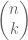
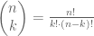
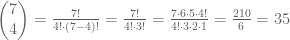

..
  Комбинаторика - увод
  reading

====================================== 
Увод и основни појмови у комбинаторици
====================================== 

Увод
----

Комбинаторика је једна од грана математике која се бави скуповима и начинима на који се могу 
комбиновати. Уско је повезана са многобројним гранама математике и примењене информатике попут 
алгебре, геометрије, рачунарству, статистичкој физици и др. 
Скупови као основни појмови у модерној математици се не дефиничу, међутим скупове можемо 
посматрати као колекцију различитих елемената у некој целини.
Скупове могу бити одређени елементима тог скупа или задатим правилима који задовољавају 
елементи скупа.
Основни појамови у комбинаторици, и најпримењенији јесу факторијел и биномни коефицијент.

Факторијал
----------

Факторијел неког природни броја јесте производ свих природних бројева који су мањи 
или једнаки њему. Факторијел се означава са узвичником !.

факторијел се израчунава на следећи начин: :math:`n!= n·(n-1)·(n-2)·(n-3)·...·(n-(n-1))`

Дакле израчунавање факторијела неког природног броја се своди на множење свих природних 
бројева од 1 до тог природног броја чији се факторијел рачуна.

Односно факторијел брија 5 био би : :math:`5! = 5·4·3·2·1 = 120`

Биномни коефицијент
-------------------

Следећи важан појам јесте биномни коефицијент који се означава са:

Oвај израз чита се као n над k. и рачуна се по формули:

Oдносно 7 над 4 би се по овој формули израчунао на следећи начин:

**Примери:**

Пример 1.
~~~~~~~~~

На колико начина Петар, Јована, Милош, Ана, Никола, 
Александар и Ђорђе могу да стоје у реду за касу у продавници?
Пошто их на каси у продавници има седморо, можемо их посматрати као 
скуп природних бројева од 1 до 7. Односно преформулисати питање на лакши начин. 
Тј. на колико начина можемо поређати бројеве од 1 до 7. 

Решење овог задатка био би факторијел од 7. 
Дакле решење је 7! а то је 7·6·5·4·3·2·1 , што је једнако 5040 начина на које се могу 
поређати ових седам људи у реду на каси.

Пример 2.
~~~~~~~~~

На колико начина Петар, Јована, Милош, Ана, Никола, Александар и 
Ђорђе могу седети заједно у биоскопу, у реду од седам седишта, тако да Петар и Јована 
седе једно поред другог?

Решење 2.
~~~~~~~~~

Њих такође и у овом примеру можемо посматрати као скуп бројева, али уз малу модификацију.
Односно како је у примеру задато да двоје морају седети једно крај другог њих не можемо 
посматрати као две целине већ као једну, тј. у овом случају наш скуп би садржао 6 целина 
од којих је 5 по један човек док су двоје једна засебна целина. Дакле имамо сличан случај 
као у претходном примеру али нам двоје чини једну целину па наш скуп се састоји од 6 целина 
и тако га треба посматрати. Решење задатка било би 6!, што је 720 начина да они седе у 
једном реду у биоскопу, тако да Јована и Петар седе заједно.

Задаци за самосталан рад
========================

Задатак 1.

На колико начина могу шест особа да седну за округли сто ако има:

а) шест места, 
б) девет места за округлим столом?

Задатак 2.

На колико начина:
а) можемо ставити 9 књига на полицу,
б) можемо ставити 4 књиге из физике, 3 књиге из хемије и 2 из математике на исту полицу тако да књиге из истих предмета стоје једна поред друге?

Предстојећи видео ће вам помоћи за решавање задатака самостално.

.. ytpopup:: v1iy4sMkz0o
    :width: 935
    :height: 600
    :align: center

