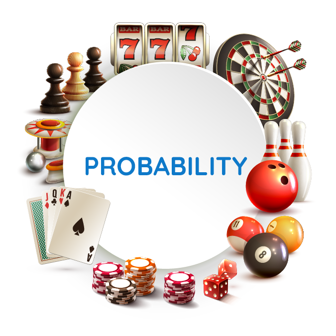

..
  Условна вероватноћа, Бајесова формула и независни догађаји
  reading

==========================================================
Условна вероватноћа, Бајесова формула и независни догађаји 
==========================================================

**Појмови које ћеш научити:**

- вероватноћa
- независни догађаји
- Бајесова формула

**Научићеш и о:**

- условној вероватноћи
- потпуној вероватноћи
- Бернулијевој шеми

Увод
----

Разлог због којег сам се определио да се бавим појмом вероватноће је њено изузетно значајно место у математици, али и у свакодневном животу. Укратко, она се бави идејом да ли ће се неки догађај догодити или не. Уколико неко дође до таквог знања, он ће бити у предности у односу на неког ко у то није упућен. Зато је познавање вероватноће потребно свима који желе да на некин начин предвиде будућност, односно преброје и забележе све могуће исходе одређеног догађаја. Модерно проучавање вероватноће почиње када су људи кренули да се баве играма на срећу, односно када им се јавила жеља за брзом и лаком зарадом. Зато не чуди чињеница да су највећи познаваоци ове области и њени родоначелници и сами били коцкари!

Жеља за брзом и лаком зарадом навела је многе коцкаре на размишљање како да играју и на прави начин уложе новац. Научни карактер вероватноћа добија током 17. века. Један од познатих математичара-коцкара био је *Ђироламо Кардано (1501-1576).*

Смишљајући стратегије за освајање новца, формулисао је нека елементарна правила вероватноће.
Написао је „Књигу о играма на срећу“ (1526) у којој наводи резултате до којих је дошао, као и савете за успешно варање. Основе за модерну теорију вероватноће, засновану на теорији мере, поставио је Андреј Колмогоров (1903-1987). 
Издао је књигу „Основе теорије вероватноће“ (1933), у којој аксиоматски заснива ову област математике.

Независни догађаји
------------------

Два догађаја А и Б су независни ако реализација једног од њих нема никакав утицај на реализацију другог. Природно је да када имамо фиксиран скуп исхода ε, поље догађаја ƒ и вероватноћу p, независност догађаја А од догађаја Б (p(Б)>0) дефинисати са p (A ┃ Б) = p (A). 

Претпоставимо да је p (A)>0. 

Тада :math:`p (Б ┃ A) = $\frac{p (AБ)}{p (A)}$ = p (Б) ∙ $\frac{p (A ┃ Б)}{p (A)}$ = p(Б) ∙ $\frac{p (A)}{p (A)}$ = p(Б)`. 

Дакле, ако је А независтан од Б, онда је и Б независтан од А. 

Ово израчунавање показује да независност догађаја А и Б можемо дефинисати на следећи начин: 

:math:`p (AБ) = p(A) ∙ p(Б)`

Ова дефиниција је примењива и када је p(A)=0 или p(Б)=0.

Пример 1:

Експеримент се састоји у насумичном одабирању једне карте из шпила од 32 карте и регистровању која је карта у питању. 
Нека је

- А = {извучен је "пик"} 
- Б = {извучена је "дама"} 

**Питање:** Да ли су догађаји А и Б независни?

**Решење:**

Очигледна независност догађаја А и Б може се поткрепити дефинцијом. Како су свих 
36 исхода једнаковероватни :math:`p(A)=\frac{1}{6}`, 
:math:`p(E)=\frac{1}{3}` и 
:math:`p(AE)=$\frac{1}{16}` (јер је АЕ = {(6,3), (6,6)}) те је :math:`p(AE) = p(A) \cdot p(E)`. 

Треба уочити: Наше претпоставке да су сви исходи једнаковероватни и 
да су догађаји типа A и E независни, су у неку руку еквивалентне. 
Ако би А и Е били зависни, не бисмо све исходе сматрали једнаковероватним.
