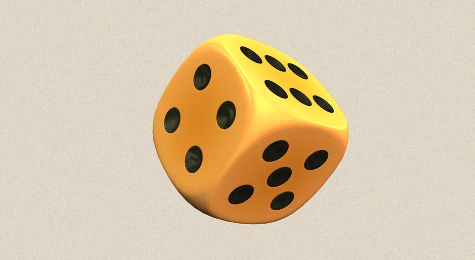
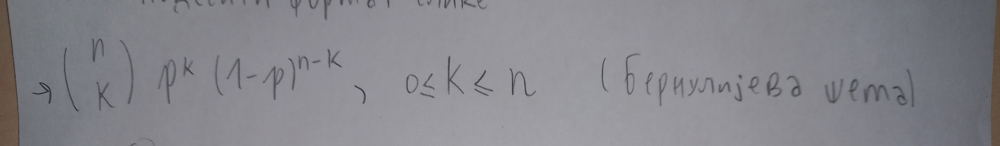

..
  Бернулијева шема
  reading

=======================================================
Бернулијева шема (понављање експеримента са два исхода)
=======================================================

.. figure:: ../../_images/bn.jpg
   :width: 450px   
   :align: center

Често случајан експеримент изводимо више пута за редом, при чему исходи 
експеримента не утичу на други, на пример, када бацамо новчић или коцку. 

Овде ћемо описати низ независних експеримената таквих да се у сваком 
експерименту или догоди догађај А или њему супротан догађај А. 

Када се понавља један експеримент са два исхода (бацање динара, убацивање лопте у кош,
реакција у хемијском експерименту - позитивна, негативна). Ако се експеримент понавља n пута,
на основу претходног, скуп исхода сложеног експеримента има исход 2 на n елемената. 

**Пример 1**

Бацамо симетричну коцку четири пута. Колика је вероватноћа да ће тачно три пута пасти шестица?

**Решење**

Овај случајан експеримент има много елементарних догађаја, тачније :math:`6^{4}`. 
Ипак, нас у сваком бацању само занима да ли је пала шестица или није. 

- Нацртајмо стабло вероватноће при чему 6 надвучено означава да није пао број 6.
- У том случају имамо 16 исхода. Повољни су 6666, 6666, 6666, 6666. То су четворочлани низови у којима се број 6 појављује тачно три пута. Знамо израчунати и да је таквих низова ($\frac{4}{3}$). 
- Због независности догађаја, вероватноћа сваког од ових исхода износи :math:`p(6666) =\frac{1}{6} \cdot \frac{1}{6} \cdot \frac{1}{6}$ \cdot \frac{5}{6} = p(6666) = p(6666) = p(6666)`.

Коначно, применом формуле уније дисјунктних догађаја следи: 
p ({тачно је пала шестица}) = $\frac{4}{3}$ ∙ $\frac{5}{6}$ ∙ $\frac{1}{6}$∙ $\frac{1}{6}$ ∙ $\frac{1}{6}$ = $\frac{5}{324}$ = 0,0154.

Дефиниција
----------

Неки експеримент понављамо n пута узастопце при истим условима. Експеримент има само два исхода: успех или неуспех. Нека је вероватноћа успеха при једном извођењу експеримента једнака p, а вероватноћа неуспеха 1-p, тада је вероватноћа да се успех понови тачно k пута једнака p(тачно k пута успех) = $\frac{n}{k}$ ∙ $p^{k}$ ∙ $(1-p)^{n-k}$, 0≤k≤n

Овај модел се назива Бернулијева шема.

Задатак 1 за самосталан рад
---------------------------

Године 1654. француски коцкар *Мере* је математичару *Паскалу* поставио проблем 
који се сматра почетком теорије вероватноће:

- "У шта се исплати више кладити - да ће у четири узастопна бацања коцке барем једном пасти шестица или да ће у 24 узастопна бацања пара коцкица барем једном пасти две шестице?"

- Пробај да одговориш на ово питање. 

Задаци и питалице за проверу знања о експериментима са два исхода 
-----------------------------------------------------------------

.. quizq:: 

   .. mchoice:: question3134
      :correct: а
      :answer_a: 0,33 
      :answer_b: 1,54
      :answer_c: 2,53
      :feedback_a: Тачно
      :feedback_b: Нетачно
      :feedback_c: Нетачно
      
      Вероватноћа да ће при бацању коцке неће пасти ниједна шестица је:

.. quizq:: 

   .. mchoice:: question323411
      :correct: a
      :answer_a: вероватноћу успеха при извођењу експеримената са два исхода (успех или неуспех)
      :answer_b: вероватноћу успеха при извођењу n зависних експеримената
      :answer_c: вероватноћу при извођењу експеримената са више могућих исхода
      :feedback_a: Тачно
      :feedback_b: Нетачно
      :feedback_c: Тачно
      
      Изабери тачну тврдњу. Бернулијева шема нам омогућава да:

.. quizq::

   .. mchoice:: question34578112
      :correct: c
      :answer_a: 0,987
      :answer_b: 0,432
      :answer_c: 0,512
      :answer_d: 0,213
      :feedback_a: Нетачно
      :feedback_b: Нетачно
      :feedback_c: Тачно
      :feedback_d: Нетачно
      
      Кошаркаш изводи слободна бацања на кош. Бацања су независна и вероватноћа поготка у 
      сваком бацању је 0,8. Вероватноћа догађаја да је из три бацања погодио три пута је:

.. quizq::

   .. mchoice:: question3457811567
      :correct: d
      :answer_a: 5/21
      :answer_b: 2/5
      :answer_c: 1/2
      :answer_d: 4/5
      :feedback_a: Нетачно
      :feedback_b: Нетачно
      :feedback_c: Нетачно
      :feedback_d: Тачно
      
      У кутији је 10 балона од којих су 4 пробушена. Ако извлачимо 5 балона, колика је вероватноћа да је међу њима тачно један пробушен?:

.. quizq::

   .. mchoice:: question34578119
      :correct: b
      :answer_a: 2/9
      :answer_b: 1/5
      :answer_c: 9/3
      :answer_d: 5/2
      :feedback_a: Нетачно
      :feedback_b: Тачно
      :feedback_c: Нетачно
      :feedback_d: Нетачно
      
      На пријемном испиту кандидати одговарају на 20 питања. За свако питање понуђено је пет одговора од којих је само један тачан. Вероватноћа догађаја да је ученик који случајно бира тачан одговор све погодио је:

Занимљив видео клип о Бернулијевом доприносу вероватноћи

.. ytpopup:: bT1p5tJwn_0
    :width: 935
    :height: 600
    :align: center
