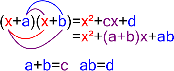

===============
Биномна теорема
===============

Биномна теорема је теорема елементарне алгебре и описује коефицијенте степена бинома 
када је он представљен у развијеној форми. 
По овој теореми, могуће је представити израз :math:`{(x + y)}^n` сумом сабирака 
облика :math:`ax^b*y^c`, 
где су коефицијенти :math:`а` позитивни цели бројеви, 
при чему је збир експонената :math:`x` и :math:`y` једнак :math:`n` за сваки сабирак. 

**На пример:**

:math:`{(x + y)}^4 = x^4 + 4 \cdot x^3 \cdot y + 6 \cdot x^2 \cdot y^2 + 4 x \cdot y^3 + y^4`

Коефицијенти који се појављују у биномном развоју називају се **биномни коефицијенти**. 

Они су идентични бројевима који се појављују у **Паскаловом троуглу**. 

Ови бројеви се могу израчунати једноставном формулом која користи факторијел.
Исти ови коефицијенти се јављају у комбинаторици, где је израз :math:`x^{n-k}\cdot y^k` 
једнак броју различитих комбинација :math:`k` елемената који се бирају из 
скупа од :math:`n` чланова.

У математици, а посебно у комбинаторици, биномни коефицијент природног 
броја :math:`n` и целог броја :math:`k` дефинисан је као природни број:

:math:`\binom{n}{k} = \frac{n!}{k!\cdot (n-k)!} = \prod_{i=0}^k (\frac{n+1-i}{i})`, :math:`n \ge k \ge 0` 
и
:math:`\binom{n}{k} = 0` ako је k<0 или k>n.

(За природни број m, m! означава факторијел броја m.)

.. ytpopup:: xlY6Ail3QA0
    :width: 935
    :height: 600
    :align: center

**Исказ теореме**

Сваки степен израза :math:`x + y` могуће је представити у форми:

:math:`{(x+y)}^n = \binom{n}{0} \cdot x^n \cdot y^0+\binom{n}{1} \cdot x^{n-1} \cdot y^1+\binom{n}{2} \cdot x^{n-2} \cdot y^2+\binom{n}{3} \cdot x^{n-3} \cdot y^3+`...:math:`+\binom{n}{n-1} \cdot x^1 \cdot y^{n-1}+\binom{0}{n} \cdot x^0 \cdot y^n`,
где :math:`\binom{n}{k}` означава одговарајући биномни коефицијент. 
Други начин записивања ове формуле је:

:math:`(x+y)^n = \sum {k=0}^n \binom{n}{k} \cdot x^{n-k} \cdot y^k`.

Задаци
~~~~~~

**1. задатак**

Развити бином :math:`{(x+2)}^6`:

**Решење:**

:math:`(x+2)^6 = \binom{6}{0} \cdot x^6 \cdot 2^0+\binom{6}{1} \cdot x^{6-1}*2^1+\binom{6}{2} \cdot x^{6-2} \cdot 2^2+\binom{6}{3} \cdot x^{6-3} \cdot 2^3+\binom{6}{4} \cdot x^{6-4} \cdot 2^4+\binom{6}{5} \cdot x^{6-5} \cdot 2^5+\binom{6}{6} \cdot x^0 \cdot 2^6`

**2. задатак**
Развити бином :math:`{(2*x+4)}^4`:

:math:`(2 \cdot x+4)^4 = \binom{4}{0} \cdot 2 \cdot x^4 \cdot 2^0+\binom{4}{1} \cdot 2 \cdot x^{4-1} \cdot 4^1+\binom{4}{2} \cdot x^{4-2} \cdot 4^2+\binom{4}{3} \cdot x^{4-3} \cdot 4^3+\binom{4}{4} \cdot x^{4-4} \cdot 4^4`

**3. задатак**
Oдредити шести члан у развоју бинома :math:`{(x+y)}^{15}`:

**Решење:**
:math:`T_6 = \binom{15}{5} \cdot x^10 \cdot y^5 = \frac{15 \cdot 14 \cdot 13 \cdot 12 \cdot 11}{5 \cdot 4 \cdot 3 \cdot 2 \cdot 1} \cdot x^10 \cdot y^5 = 3003 \cdot x^10 \cdot y^5`

**4. задатак**
Oдредити шести члан у развоју бинома :math:`(\sqrt{x}-\sqrt{y})^12`:

**Решење:**

:math:`T_6 = \binom{12}{4} \cdot \sqrt{x}^8 \cdot (-\sqrt{y})^4 = \frac{12 \cdot 11 \cdot 10 \cdot 9}{4 \cdot 3 \cdot 2 \cdot 1} \cdot x^4 \cdot y^2 = 495 \cdot x^4 \cdot y^2`

**5. задатак**

Oдредити биномни коефицијент уз пети члан у развоју бинома :math:`(2 \cdot \sqrt{x}-1)^8`:

**Решење:**

:math:`\binom{8}{4} = \frac{8 \cdot 7 \cdot 6 \cdot 5}{4 \cdot 3 \cdot 2 \cdot 1} = 70`

Питања:
~~~~~~~

1.Како гласи биномна формула?

2.Шта је биномни коефицијент?

3.Какву улогу имају биномни коефицијенти у комбинаторици?

4.Како гласи уопштени биномни коефицијент?

5.Ко је први дошао до идеје о биномној формули?

