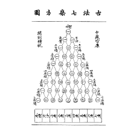
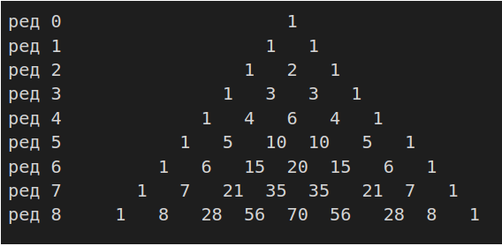

===================
Биномни коефицијент
===================

Биномни коефицијент од n и k се такође пише и као C(n, k) или C_n^k и чита као »n над k«. 
Према Николасу Хигаму, нотацију :math:`\binom{n}{k}`.
је увео у употребу Алберт фон Етингхаузен 1826, иако се за ове бројеве знало 
вековима пре тога.

**Пример:**

:math:`\binom{7}{3} = \frac{7 \cdot 6 \cdot 5}{3 \cdot 2 \cdot 1} = 35`

Биномни коефицијенти су коефицијенти у развоју бинома :math:`{(x+y)}^n` (одатле и назив):
:math:`(x+y)^n = \sum {k=0}^\k \binom{n}{k}x^k \cdot y^{n-k}`

Ово је генерализовано биномном теоремом која дозвољава да :math:`n` буде негативан 
или реалан број.

.. ytpopup:: f0fCfJwC2jo
    :width: 935
    :height: 600
    :align: center

Паскалов троугао
~~~~~~~~~~~~~~~~

Паскалов троугао представља бесконачан низ природних бројева, који је у 
облику пирамидалне шеме. 
Сваки број у једном реду представља збир бројева који су изнад њега. 

Крајњи бројеви шеме су увек јединице. Ови бројеви посматрани по врстама 
понашају се као биномни коефицијенти. 

Назив је добио по математичару **Блезу Паскалу**.

На пример, k-ти број у n-том реду је једнак :math:`\binom{n}{k}` и и чита се као n над k. 
Због симетричности редова, није битно да ли се броји слева или здесна.
У почетну врсту уписује се 1. Претпостављајући да свака врста почиње и 
завршава се са по једном нулом (ове нуле се не пишу), свака врста се образује 
помоћу претходне сабирањем по два узастопна члана у претходној врсти и исписивањем 
сваког збира у средини размака између сабирака.

1. Збир Sn бројева у n-тој врсти је удвостручен збир Sn-1 бројева у претходној врсти. To је зато што се међу члановима n-те врсте који образују суму Sn по два пута јавља сваки од бројева из претходне врсте.

2. У свакој врсти, два од крајева једнако удаљена члана међусобно су једнака. Код првих врста може се запазити симетрија у односу на вертикалну осу фигуре.Према правилу по ком формирамо врсте, ова симетрија прелази са сваке врсте на следећу и тако се бескрајно наставља.

3. У свакој врсти, збир елемената парних редних бројева и збир елемената непарних редних бројева је једнак. Сваки од њих је збир у коме по једанпут фигурише сваки од елемената претходне врсте. 

4. Елеменат који настаје сабирањем узастопних елемената а и б претходне врсте (а се налази лево а б десно), једнак је збиру бројева на које се наилази пењући се било од а по паралели леве странице троугла, било од б по паралели десне странице. Могу се извршити нумеричка проверавања, на пример за број 15, који се налази у седмој врсти: (5+4+3+2+1 и 10+4+1)

5. Може се приметити да у написаним врстама чланови расту уколико се приближавамо средишњој колони. Јасно је да, ако овај закон важи за једну врсту, важи и за следећу. Он је дакле, општи. Свака врста непарног редног броја има члан који је једнако удаљен од крајева, већи је од свих осталих бројева. Важна рекурзивна релација

:math:`C(n,k) + C(n,k+1) = C(n+1,k+1)`

следи директно из дефиниције биномног коефицијента. 
Овом релацијом, и математичком индукцијом се може доказати да је :math:`C(n, k)` 
природни број, за свако n и k (што није најочигледније одмах из дефиниције).
На тај начин се конструише Паскалов троугао:

n.-ти ред садржи бројеве :math:`C(n, k)` за k = 0,...,n. 
Паскалов троугао се конструише тако да се креће од 1, а нови број се 
добија сабирањем суседа из претходног реда. Овако се брзо могу израчунати 
биномни коефицијенти без потребе за множењем и дељењем.
Године 1303. у делу *Драгоцено огледало четири елемента* 
(Precious Mirror of the Four Elements) Цу Шиђе (Zhu Shijie) 
помиње овај троугао за решавање биномних коефицијената, 
што указује да је овај метод био познат кинеским математичарима пет 
векова пре Блез Паскала.

