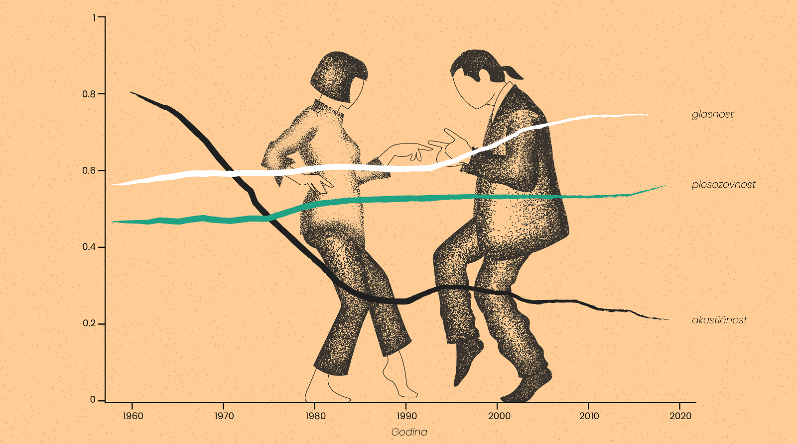
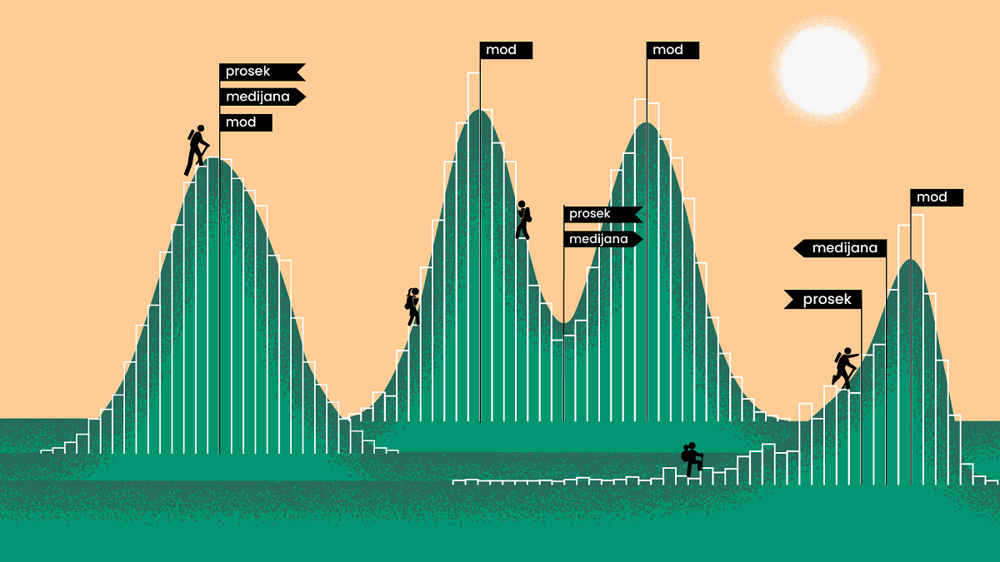

=========================================
Елементи математичке статистике и примене
=========================================

Статистика и музика
~~~~~~~~~~~~~~~~~~~

**У овој лекцији научићеш:**
    
- како су статистика и музика повезане
- на које начине се статистика може применити у музичкој индустрији
- на шта треба обратити пажњу при статистичкој анализи

Као што је раније речено, статистика се користи у науци, али и у многобројним аспектима свакодневног живота. 
У овој лекцији издвојен је њен утицај на музику, односно на музичку индустирју.

Статистика омогућава музичкој индустрији да сазна шта људи слушају, али не само то; 
такође може да им каже где, када и колико пута су слушали песму или одређени жанр. 
Тако на пример знамо да се музика најчешће слуша у колима, затим док се одмарамо кући, на путу до школе 
или посла итд... 

Када размишљамо о музици, углавном је то везано за неку песму коју смо скорије чули и свидела нам се, 
или за нашег омиљеног извођача, а ретко се обазиремо на то какав значај статистика има на њихов успех. 
Наиме, управо резултати статистичке анализе, или како то другачије зовемо када је реч о музици, 
,,ранг листе’’ највише утичу на то да ли ћемо уопште чути за неку песму или не. 
Што је већи број људи послушао одређену песму, то је већи њен успех и она постаје све популарнија, 
а самим тим су шансе веће да ћемо је и ми одслушати и да ће нам се допасти. 
Све то је заправо последица статистичке анализе података који се сакупљају 
ради разумевања потражње слушалаца са циљем што већег маркетиншког успеха.

.. figure:: ../../_images/spotify1.jpg
   :width: 500px   
   :align: center

При анализи, неопходно је да узорак, у овом случају скуп песама или извођача, буде репрезентативан, односно насумично изабран. Посебно се мора водити рачуна када се, спроводе истраживања у којима учествују испитаници, на основу чијих одговора ми желимо да донесемо закључак о понашању целе популације. Међутим, када су у питању подаци који су сакупљени за неку другу намену (нпр. у овом случају песме су прикупљене и анализиране за потребе платформе Spotify), репрезентативност често неће бити гарантована. Горње две листе нису у потпуности меродавне, јер су узорци преузимани само са платформе Spotify, те не можемо увек бити сигурни да је резултат тачан док не упоредимо са другим платформама. Међутим, то што постоји разлог да сумњамо у валидност ових листа (у односу на неки најшири скуп свих песама или извођача на свету) не значи да анализа нема смисла, само да је потребно да будемо опрезнији при доношењу закључака.

Оно што је исто занимљиво је да уз помоћ статистике можемо видети и како се музика мењала до данас. Утицај технологије је евидентан у променама акустичности и гласноће музике, као и у многим другим карактеристикама. Можемо закључити да су песме постајале све гласније, и све мање акустичне, тј. све више се ослањају на употребу електричних инструмената и електронску обраду звука.

   

График приказује трендове промена у целокупном скупу података кроз приказ просечних вредности. 
То значи да је у сваком временском периоду постојало пуно песама и веће и мање акустичности, 
као и веће и мање гласноће и других карактеристика. Главна порука је да, када користимо 
просек да сажмемо неку велику групу података, погледамо дистрибуцију података и уверимо се 
да је просек заиста меродаван.

   

Све у свему, важно је знати да се у данашње време статистика може користити за напредак 
веома великог броја дисциплина и аспеката свакодневног живота, и потребно је ту предност 
коју нам она даје на адекватан начин искористити. Музичка индустрија, као и многе друге, 
има огромну корист од статистичке анализе, због чега можемо видети колико статистика утиче 
на наш доживљај музике, али често и на сам музички укус.

Задаци и питања за вежбу:
-------------------------

.. quizq:: 

   .. mchoice:: question41
      :correct: b
      :answer_a: Објективност
      :answer_b: Меродавност
      :answer_c: Квалитативност
      :feedback_a: Нетачно
      :feedback_b: Тачно
      :feedback_c: Нетачно
      
      Одреди тачне одговоре. Шта треба чинити при анализи музичких ранг листа?

.. quizq:: 

   .. mchoice:: question42
      :multiple_answers:
      :correct: a,c
      :answer_a: Треба обратити пажњу на извор података коришћених за анализу.
      :answer_b: Треба гледати резултате само једне ранг листе.
      :answer_c: Треба бити опрезнији при доношењу закључака.
      :feedback_a: Тачно
      :feedback_b: Нетачно
      :feedback_c: Тачно
      
      Одреди тачне тврдње. Знање из математичке статистике:

