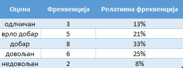
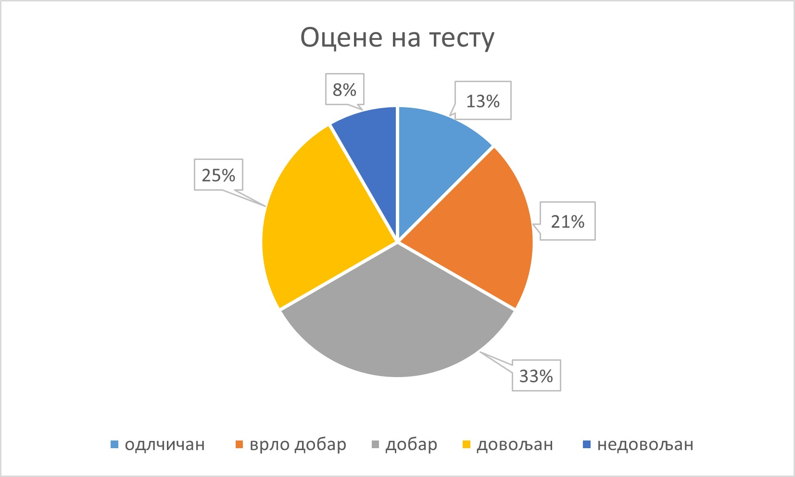
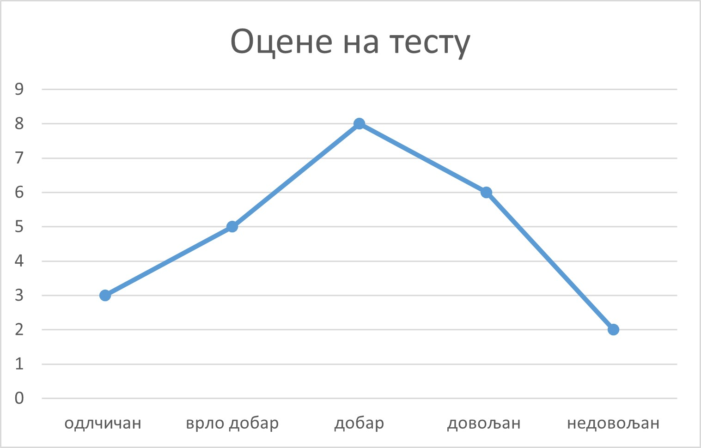
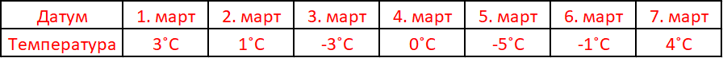
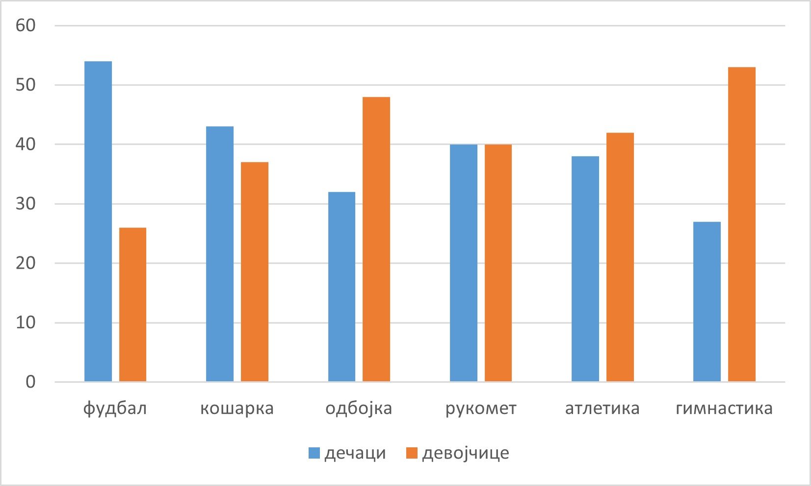
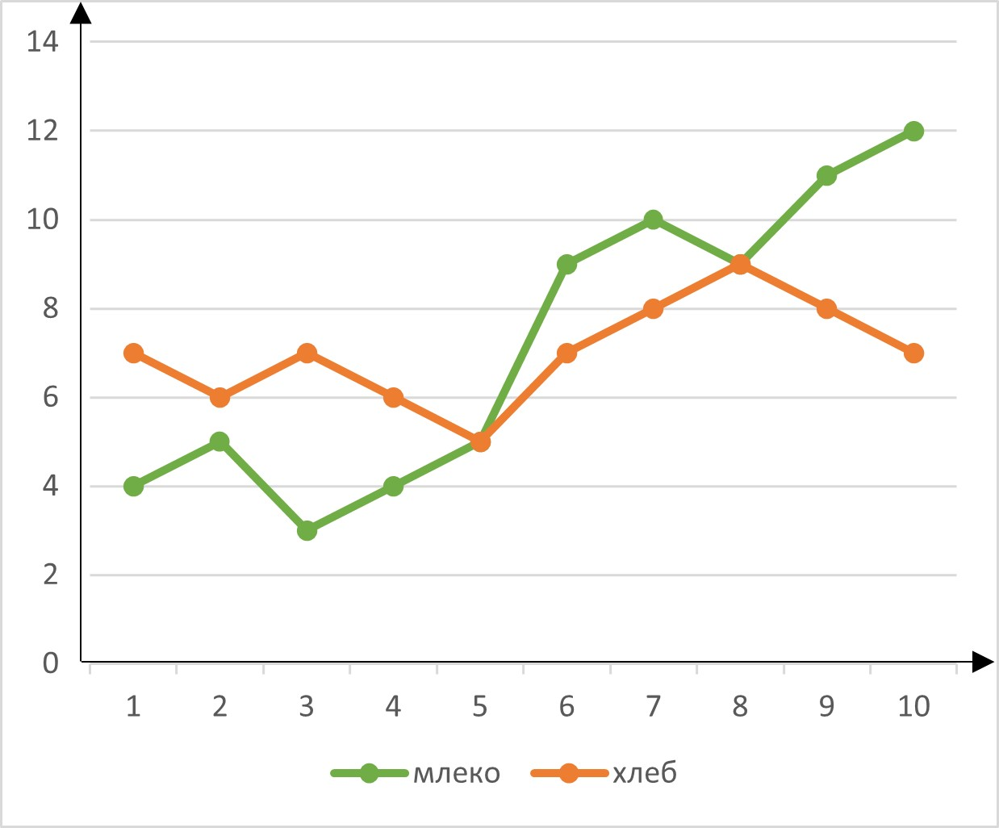
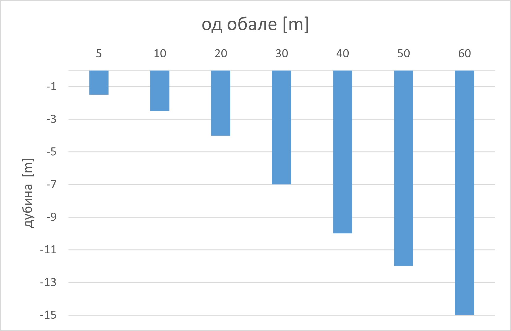
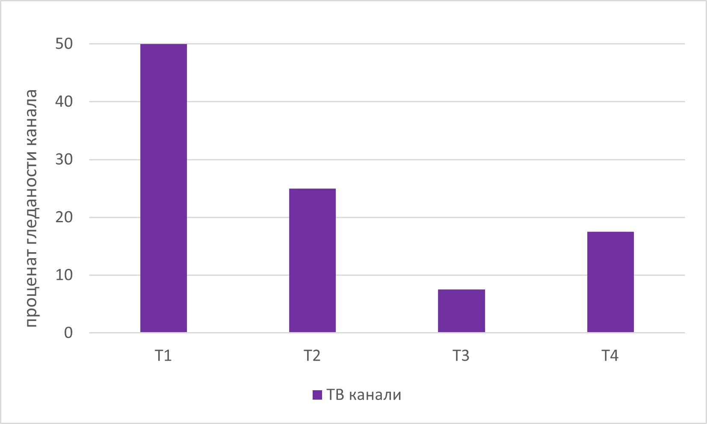
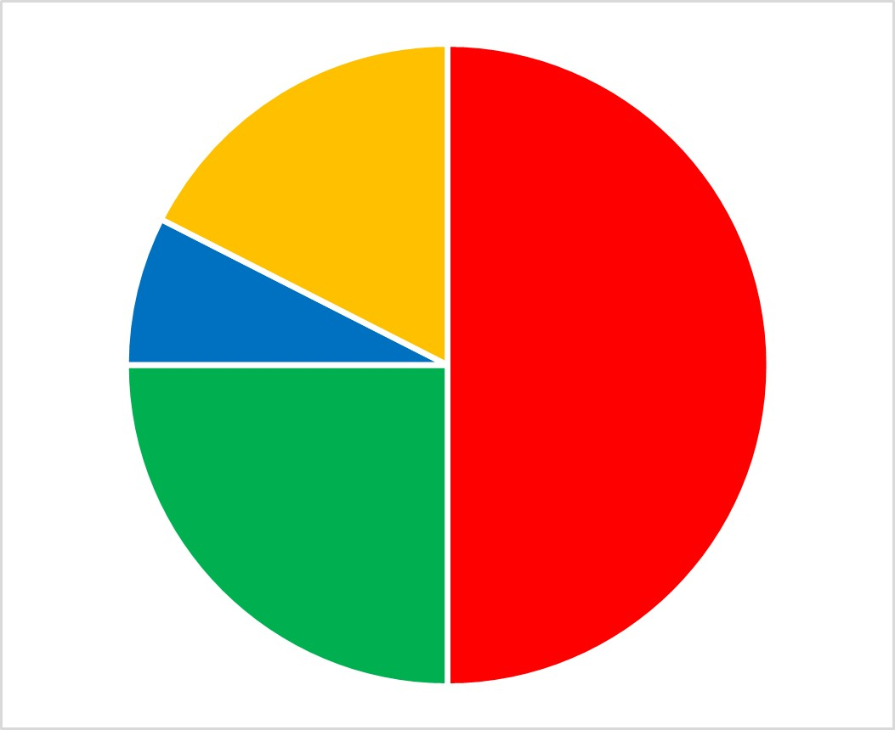
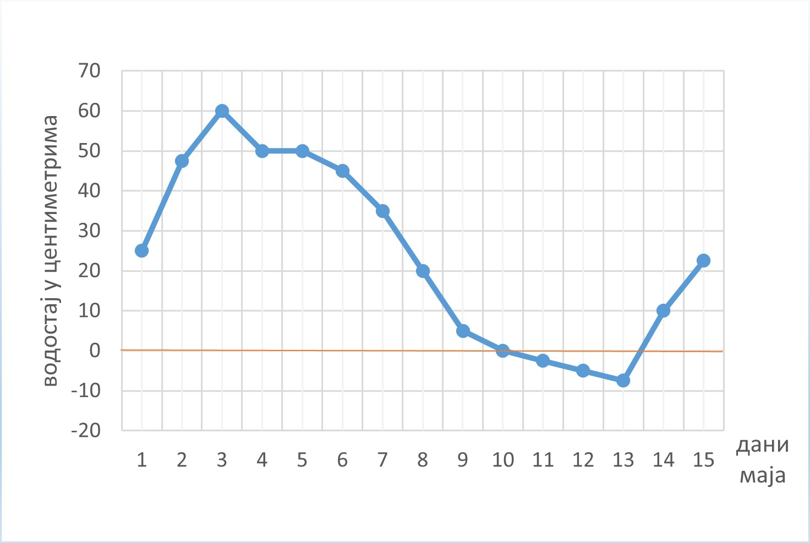

======
Подаци
======

.. infonote:: **У овој лекцији ћеш учити о томе шта су подаци**

   Појмови које ћеш научити су:

  - подаци 
  - нумерички подаци
  - номинални подаци
  - статистика, елементи статистике
  - информација 

Подаци
------

У овом делу лекције учићеш о томе шта су подаци, како можемо да их прикажемо, као и о томе шта је 
фреквенца податка, а шта релативна фреквенција податка.

Податак је појам који описује и квантификује стање неког процеса у реалном свету. 
Свакодневно се бавимо њиховим прикупљањем у свим сферама живота. На овај начин пратимо цене производа, 
број оболелих од неког вируса, број ученика у једној генерацији... 
Податак представља приказ чињеница, појмова и инструкција, на симболички и формализован начин, 
за интерпретацију и обраду уз помоћ људи или машина.

У основи он је порука која се може и не мора искористити, у случају да постоји и 
најмања вероватноћа да се порука једнозначно и тачно искористи, тада он представља информацију. 
О информацијама ћеш детаљније учити у другом делу лекције.

Фреквенца податка je заправо број појављивања одређеног податка, 
док је релативна фреквенција податка однос (проценат) његове заступљености у популацији или 
у групи коју посматрамо.

Начини на које можеш да представиш податке су уз помоћ таблице или дијаграма.

.. questionnote:: **Задатак:**

  Први разред има 24 ученика. На тесту из математуике, који су сви радили, три ученика је добило оцену пет (одличан), 
  петоро ученика је добило оцену четири (врло добар), осморо ученика је добило оцену три (добар), 
  шест ученика је добило оцену два (довољан), и двоје ученика оцену један (недовољан). 
  Како мошемо приказати ове податке?

Један начин је **таблица**.

У првом реду наводимо шта ће та табела да заправо садржи. Остатак табеле попуњавамо уношењем података који су нам дати.

.. rst-class:: text-center

      **Табеларни приказ**

Када је у питању колона под називом "фреквенција" она заправо представља број ученика који је 
добио одређену оцену, а колона под називом "релативна фреквенција", представља који је проценат 
ученика са одређеном оценом, у њу уместо процента можемо и унети однос у виду разломка, 
нпр. 3/24 уместо 13% у реду где су наведени ученици са одличним оценама.

Када је у питању **представљање преко дијаграма** врсте су многобројне. у наставку лекције моћи ћеш да видиш три врсте.

.. figure:: ../../_images/stubprimer1.jpg
        :width: 450px   
        :align: center

.. rst-class:: text-center

      **Стубичасти дијаграм**

.. rst-class:: text-center

      **"Пита" дијаграм**

.. rst-class:: text-center

      **Линијски дијаграм**

.. questionnote:: **Задатак:**

  На основу датог дијаграма попунити табелу.

  .. figure:: ../../_images/primer2.jpg
        :width: 450px   
        :align: center

Статистика
----------

Статистика је научни метод који се примењује са сврхом описивања, 
процене и анализе неке карактеристике друштва. Она представља грану математике која прикупља, 
анализира, тумачи, обрађује и приказује податке чија је основна карактеристика варијабилност. 
Прикупљање података врши се из популације. Појаве које се јављају непредвидиве су и то је 
условило потребу за њиховим предвиђањем и самим тим формирањем овог научног метода. 
Савремена статистика обезбеђује квантитативне методе и технике за потребе емпиријских истраживања. 
Садржи методологију помоћу које се врши мерење неизвесности и испитују се последице утицаја 
те неизвесности на планирање и тумачење резултата експериментисања и посматрања.

Реч статистика потиче од латинске речи *„statisticus“* што у преводу значи државни послови. 
Немачки професор Херман Конринг 1660. године први је употребио реч „статистика” у својим предавањима. 
У почетку се статистика односила само на нумеричке податке на бројно стање становника, 
пореских обвезника, имовине, војника и свега оног што је било примарно интересовање тадашњих владара државе. 
Верује се да су прве статистичке методе коришћене чак у 5 веку п.н.е. Најстарији записи о кориштењу статистике 
потичу из 9. века, а из 14 вака иаммо записе који садрже низ статистичких података о популацији, едукацији...

**Варијабла** представља променљиве карактеристике атрибута који се разликују од особе до 
особе или од појаве до појаве, док су подаци вредности посматраних променљивих. 
**Варијабилност** појаве која се испољава преко одступања од општих карактеристика те 
појаве представља оно чиме се статистика бави.

**На основу дефиниција статистике и доступних информација о њеном развоју статистику можемо поделити на четири фазе:**

- Прва фаза развоја - прикупљање података. 
- Друга фаза развоја - долази до формирања два концепта јер у том периоду долази до развоја немачке дескриптивне школе и енглеске школе аритметике. 
- Трећа фаза развоја - повезивање статистике и вероватноће. 
- Четврта фаза развоја - појава савремене статистике

**Статистика се може поделити у две целине:**

- Дескриптивна статистику чији је задатак сумирање података у лако разумљиву целине,
- Инферецијална статистика (индуктивна статистика) које подразумева извођење закључка о скупу на основу узорка података,

Информација
-----------

**Информацију** чини скуп логички повезаних података, обрађених и организованих чињеница које 
представљају неко обавештење. Можемо их схватити као податак којем је придружен контекст. 
Реч информација потиче од латинске речи *"Informare"* што значи информисање, обавјештавање. 
Информација постаје знање кад је интерпретирана, односно стављена у контекст или кад јој је додато 
значење. Значење информације може бити корисно, али и не мора. 

.. figure:: ../../_images/informacija.jpg
    :width: 450px   
    :align: center

Како би податак постао информација он мора да:

- буде важан за субјекта на кога се односи, у смислу да садржи нове инфовмације како би проширио знање примаоца,
- буде у облику у ком да рачунар може да га обрађује.

Задаци и питања за вежбу:
-------------------------

Посматрај дијаграм са слике и одговори на следећа питања:

.. quizq:: 

   .. mchoice:: question41678
      :correct: c
      :answer_a: Кошарком
      :answer_b: Одбојком
      :answer_c: Фудбалом
      :feedback_a: Нетачно
      :feedback_b: Нетачно
      :feedback_c: Тачно
      
      Стубичастим дијаграмом приказано је којим се спортом баве ученици и ученице у спортској гимназији. 
      Погледај дијаграм и дај одговор на питање. Којим спортом се бави највише дечака:

      

.. quizq:: 

   .. mchoice:: question42345
      :correct: c
      :answer_a: Дечака
      :answer_b: Девојчица
      :answer_c: Подједнак број дечака и девојчица
      :feedback_a: Нетачно
      :feedback_b: Нетачно
      :feedback_c: Тачно
      
      Да ли се рукометом бави више:

    

.. quizq:: 

   .. mchoice:: question43
      :correct: a
      :answer_a: Одбојка и гимнастика
      :answer_b: Рукомет и атлетика
      :answer_c: Фудбал и гимнастика
      :feedback_a: Тачно
      :feedback_b: Нетачно
      :feedback_c: Нетачно
      
      Која два спорта ссе бави више девојчица него дечака:

    

Посматрај дијаграм са слике и одговори на следећа питања:

.. quizq:: 

   .. mchoice:: question44
      :correct: c
      :answer_a: Другог дана
      :answer_b: Шестог дана
      :answer_c: Петог дана
      :feedback_a: Нетачно
      :feedback_b: Нетачно
      :feedback_c: Тачно
      
      Линијским графиконом приказана је продаја млека и хлеба у једној продаавници. Дуж x-осе приказан је временски период, а дуж y-осе количина производа купљена у току дана.
      Који дан је купљена иста количина хлеба и млека: 

    

.. quizq:: 

   .. mchoice:: question45
      :correct: b
      :answer_a: Купљено је више хлеба 
      :answer_b: Купљено је више млека
      :answer_c: Подједнак број је купљен
      :feedback_a: Нетачно
      :feedback_b: Тачно
      :feedback_c: Нетачно
      
      У датом временском периоду од 10 дана да ли је купљено више хлеба, млека, или је подједнако купљено:

.. quizq:: 

   .. mchoice:: question46
      :correct: a
      :answer_a: Десети дан
      :answer_b: Трећи дан
      :answer_c: Седми дан
      :feedback_a: Тачно
      :feedback_b: Нетачно
      :feedback_c: Нетачно
      
      Који дан је била највећа разлика у броју продатих производа:

Посматрај дијаграм са слике и одговори на следећа питања:

.. quizq:: 

   .. mchoice:: question47
      :correct: a
      :answer_a: 5 метара
      :answer_b: 0 метара
      :answer_c: 20 метара
      :feedback_a: Тачно
      :feedback_b: Нетачно
      :feedback_c: Нетачно
      
      У Сутомору поред Велике Стене мерена је дубина мора. Подаци добијени уцртани су на дијаграм са штапићима. Одговори на дата питања помоћу дијаграма. 

.. quizq:: 

   .. mchoice:: question48
      :correct: c
      :answer_a: 11 метара
      :answer_b: 15 метара
      :answer_c: 10 метара
      :feedback_a: Нетачно
      :feedback_b: Нетачно
      :feedback_c: Тачно
      
      Коликиа је дубина мора на 40 метара од обале:

.. quizq:: 

   .. mchoice:: question49
      :correct: a
      :answer_a: До 40 метара
      :answer_b: До 60 метара
      :answer_c: До 65 метара
      :feedback_a: Тачно
      :feedback_b: Нетачно
      :feedback_c: Нетачно
      
      Колико најближе обали може прићи брод чији је труп 10 метара под водом:

Посматрај дијаграм са сликa и одговори на следећа питања:

.. quizq:: 

   .. mchoice:: question481
      :correct: b
      :answer_a: Плави 
      :answer_b: Црвени
      :answer_c: Зелени
      :feedback_a: Нетачно
      :feedback_b: Тачно
      :feedback_c: Нетачно
      
      Док је ТВ канал Т1, преносио финале Вимблдона, мерена је гледаност ТВ канала Т1, Т2, Т3, И Т4. Резултат је приказан на стубичастом дијаграму. У складу са тим одговори на доле задата питања у вези пита дијаграма. 
      Који део пита дијаграма показује гледаност Т1 канала:

.. quizq:: 

   .. mchoice:: question49267
      :correct: b
      :answer_a: Т1
      :answer_b: Т4
      :answer_c: Т3
      :feedback_a: Нетачно
      :feedback_b: Тачно
      :feedback_c: Нетачно
      
      Гледаност ког канала представља жуто поље на пита дијаграму:

.. quizq:: 

   .. mchoice:: question49189
      :correct: a
      :answer_a: Плавом
      :answer_b: Црвеном
      :answer_c: Зеленом
      :feedback_a: Тачно
      :feedback_b: Нетачно
      :feedback_c: Нетачно
      
      Којом бојом је приказана гледаност канала са најмање гледалаца:

Посматрај дијаграм са сликe и одговори на следећа питања:

.. quizq:: 

   .. mchoice:: question41067
      :correct: c
      :answer_a: 1. maja
      :answer_b: 2. maja
      :answer_c: 3. maja
      :feedback_a: Нетачно
      :feedback_b: Нетачно
      :feedback_c: Тачно
      
      Ког датума је био највиши водостај:

.. quizq:: 

   .. mchoice:: question41178
      :correct: b
      :answer_a: 1. maja
      :answer_b: 5. maja
      :answer_c: 10. maja
      :feedback_a: Нетачно
      :feedback_b: Тачно
      :feedback_c: Нетачно
      
      Ког дана је река стагнирала (није мењала водостај):

.. quizq:: 

   .. mchoice:: question41289
      :correct: b
      :answer_a: 25 центиметара
      :answer_b: 10 центиметара
      :answer_c: 40 центиметара
      :feedback_a: Нетачно
      :feedback_b: Тачно
      :feedback_c: Нетачно
      
      Колики је био водостај 14. маја:

