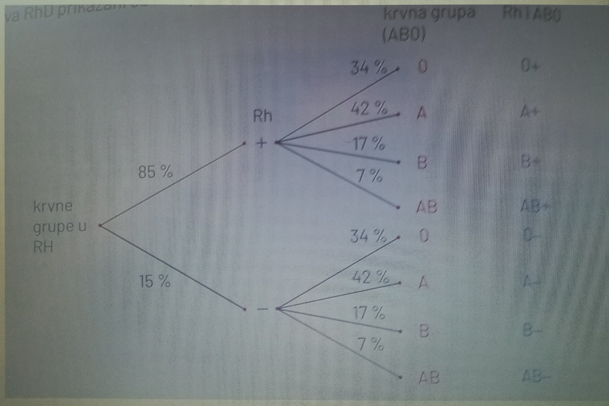
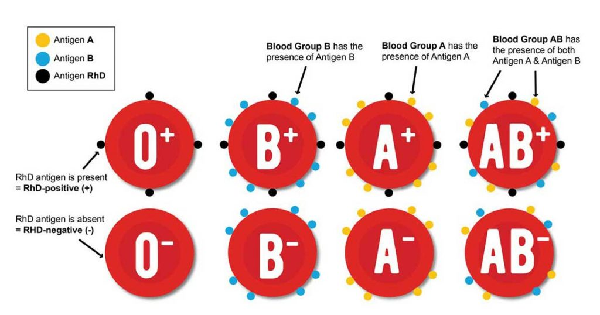
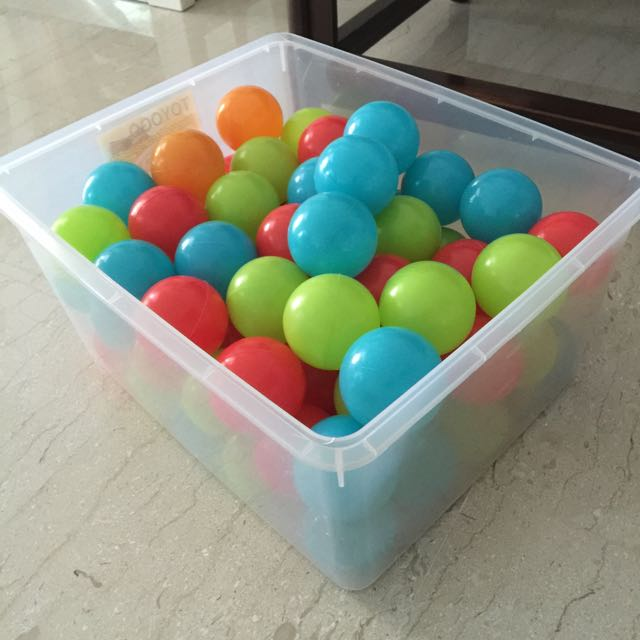
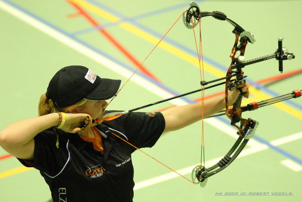
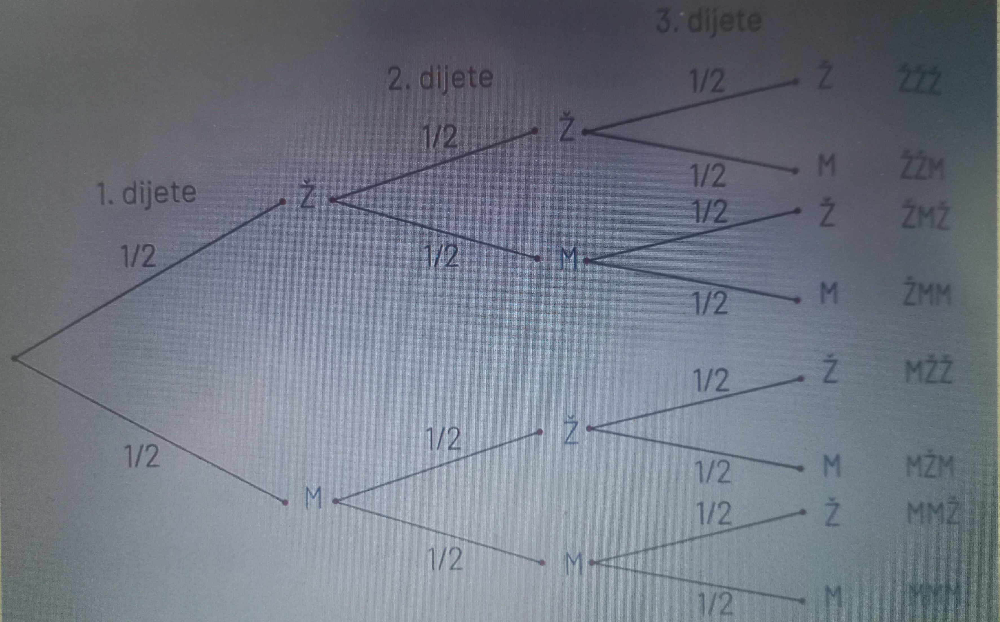
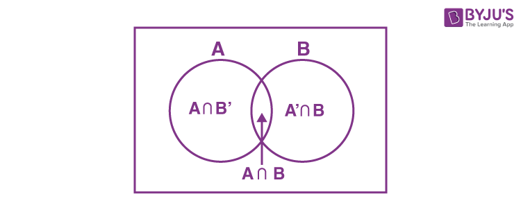

## Стабло вероватноће

*Стабло вероватноће*, због своје прегледности и систематичности, врло често се примењује за рачунање вероватноће низа догађаја. Из тог разлога, можемо га искористити и у овом кратком примеру. 

Узмимо пример крвних група. Случајно одабрана осба може имати једну од ледећих комбинација крвних група и Rh фактора  
- 0+ 
- А+ 
- Б+ 
- АБ+ 
- 0- 
- А- 
- Б- 
- АБ-

Подаци о распрострањености крвних група у Хрватској из састава АБО и подаци уз састава RhD приказају се преко стабла вероватноће. 

Прво гранање показује да је у Хрватској 85% становништва :math:'R\sb{h}'
 позитивно, а 15% Rh негативно, односно вероватноћа да је особа :math:'R\sb{h}' позитивна износи 0,85 а да је :math:'R\sb{h}' негативна 0,15. 

Друго гранање наставља се на сваку од претходних грана, а показује вероватноћу да нека особа има крвну групу 0, А, Б или АБ. 

Уколико се користе подаци са једне гране са првог и једне гране са другог гранања која је са њом повезана може се израчунати вероватноћа свих комбинација крвне групе и :math:'R\sb{h}' фактора. 

На пример, будући да 34% особа има крвну групу 0, рачунамо да ће 34% од 85% :math:'R\sb{h}' позитивних особа имати крвну групу 0, па је 
p (0+) = 0,34 ∙ 0,85 = 0,289. 
Слично се рачуна и за остале комбинације: 

- p (А+) = 0,85 ∙ 0,42 = 0,357

- p (Б+) = 0,85 ∙ 0,17 = 0,1445

- p (АБ+) = 0,85 ∙ 0,07 = 0,0595

- p (0-) = 0,15 ∙ 0,34 = 0,051

- p (А-) = 0,15 ∙ 0,42 = 0,063

- p (Б-) = 0,15 ∙ 0,17 = 0,0255

- p (АБ-) = 0,15 ∙ 0,07 = 0,0105

Уочимо да је збир вероватноћа у сваком гранању једнак 1, као и збир вериватноћа коначних исхода јер су то сви могући исходи за постављен експеримент.

## Задатак за самосталан рад 1

Нацртај стабло вероватноће за експеримент бацања три новчића.

# Независни догађаји

## Пример 1

Бацамо новчић и коцку. Новчић је могао пасти на писмо или главу, а на коцки један од шест бројева. 

- Зависи ли исход бацања коцке од исхода бацања новчића?

Јасно је да та два догађаја нису повезана, односно да исход једног од њих не утиче на исход другог. 
- У вероватноћи се овакви догађаји означавају као *независни догађаји*. 
- Како независност утиче на вероватноћу? 
- Погледати пример 1.

## Пример 2

Бацамо новчић и коцку. Нека су догађаји:

1. А = {новчић је пао на писмо}
2. Б = {на коцки је пао број 4}

- Одредимо вероватноћу p (А) и p (Б).
- Колика је вероватноћа да је пало писмо и број 4?

Израчунати умножак p (А) ∙ p (Б) и упоредити резултате.

## Решење

- Бацање новчића има 2 једнако вероватна исхода па је P (А) = :math:'\frac{1}{2}'
- Бацање коцке има 6 једнако вероватних исхода па је P (Б) = :math:'\frac{1}{6}'
- Бацање новчића и коцке има 2∙6 једнако вероватних исхода па је P (А ∩ Б) = :math:'\frac{1}{12}' 

Дакле, 
- P (А ∩ Б) = P (А) ∙ P (Б)
- Видели смо у претходном примеру да за независне догађаје вреди P (А ∩ Б)= P (А) ∙ P (Б). То се често користи и као дефинција вероватно независних догађаја.

## Дефинција
- За два догађаја А и Б кажемо да су независни ако важи: 
- p (А ∩ Б) = p (А) ∙ p (Б)

Ако је интуитивно јасно или из текста задатка да су догађаји независни, дефиниција незвисности се употребљава за рачунање *вероватних пресека*. 

## Пример 3

У кутији се налази 8 црвених и 5 плавих куглица. Извучемо једну куглицу, вратимо је у кутију, па извучемо још једну. 
- Колика је вероватноћа да је прва извучена куглица црвена, а друга плава?
- Колика је вероватноћа да су извучене црвена и плава куглица? 

## Решење

- У кутији је 13 куглица. Означима са А и Б догађаје:
- A = {прва куглица је црвена}
- Б = {друга куглица је плава}
Након што извучемо једну куглицу, вратимо је у кутију. За друго извлачење имамо 13 куглица у кутији па је јасно да исход првог извлачења не утиче на исход другог извалачења, односно да су догађаји А и Б независни. 
- p (А ∩ Б) = p (А) ∙ p (Б) = :math:'\frac{8}{13}' ∙ :math:'\frac{5}{13}' = :math:'\frac{40}{169}'
- Догађај Ц = {извучене су црвена и плава куглица} можемо записати као унију догађаја {прва куглица је црвена, друга куглица је плава} и {прва куглица је плава, друга куглица је црвена}.
- Догађај {прва куглица је плава} = {друга куглица није плава} = Г 
- Аналогно, {друга куглица је црвена} = {друга куглица није плава} = Д 
- Сада је 
- p (Ц) = p ((А ∩ Б) ∪ (Г ∩ Д)) = p (А ∩ Б) + p (Г ∩ Д) = (:math:'\frac{8}{13}' ∙ :math:'\frac{5}{13}') + (:math:'\frac{5}{13}' ∙ :math:'\frac{8}{13}') = :math:'\frac{80}{169}'

## Задатак за самосталан рад 1

- Два пута завртимо коло среће са слике. Колика је вероватноћа да смо:

а) први пут добили број мањи од 4, а други пут паран број

б) оба пута добили паран број

ц) први пут добили црвено, а други пут непаран број?

## Пример 4

- Три стрелца независно један од другог гађају мету. Вероватноћа њихових погодака су редом :math:'\frac{3}{5}', :math:'\frac{2}{3}', :math:'\frac{1}{2}'. Колика је вероватноћа догађаја: 

a. сва 3 стрелца су погодила мету

б. тачно је један стрелац погодио мету

ц. барем је један стрелац погодио мету

## Решење
- А = {први стрелац је погодио мету}
- Б = {други стрелац је погодио мету}
- Ц = {трећи стрелац је погодио мету}
- Овде је задато да су догађаји А, Б и Ц независни. Сада је 
- p (А ∩ Б ∩ Ц) = p (А) ∙ p (Б) ∙ p (Ц) = :math:'\frac{3}{5}' ∙ :math:'\frac{2}{3}' ∙ :math:'\frac{5}{6}' =  :math:'\frac{1}{3}'
- Догађај {тачно један стрелац је погодио мету} = {први је погодио и други није погодио и трећи није погодио или први није погодио и други није погодио и трећи је погодио}
- Сва три случаја се међусобно искључују, а погодак или промашај једног од стрелаца не утиче на остала два стрелца. Сада је: p ((А ∩ Б" ∩ Ц")) ∪ ((Ā ∩ Б ∩ Ц")) ∪ ((Ā ∩ Б" ∩ Ц)) = p ((А ∩ Б" ∩ Ц")) + ((Ā ∩ Б ∩ Ц")) + ((Ā ∩ Б" ∩ Ц)) = p (А) ∙ p (Б") ∙ p (Ц") + p (Ā) ∙ p (Б) ∙ p (Ц") + p (Ā) ∙ p (Б") ∙ p (Ц) = :math:'\frac{3}{5}' ∙ :math:'\frac{1}{3}' ∙ :math:'\frac{1}{6}' +  :math:'\frac{2}{5}'∙ :math:'\frac{2}{3}' ∙ :math:'\frac{1}{6}' + :math:'\frac{2}{5}' ∙ :math:'\frac{1}{3}' ∙ :math:'\frac{5}{6}' = :math:'\frac{17}{90}'
- Догађај (барем је један стрелац погодио мету) је унија догађаја А, Б и Ц, односно мету је погодио тачно један стрелац или тачно два стрелца или тачно три стрелца. Међутим, тај догађај је супротан догађају {ниједан стрелац није погодио}, што је једноставније израчунати. 
- p {барем је један стрелац погодио} = 1 - p {ниједан стрелац није погодио}
p (А ∩ B ∩ Ц) = 1 - p (Ā ∩ Б" ∩ Ц") = 1 - :math:'\frac{2}{5}' ∙ :math:'\frac{1}{3}' ∙ :math:'\frac{1}{6}' = :math:'\frac{44}{45}'

## Задатак за самосталан рад 2

Вероватноћа да Луција закасни у школу је 0,3 , вероватноћа да Ива закасни је 0,1 док је вероватноћа да Дорија закасни 0,35. Њихови доласци у школу су међусобно независни. Колика је вероватноћа да неки дан тачно две закасне у школу?

### Напомена

Дефиниција нам омогућава и једноставну проверу независности неких догађаја у којима се вероватноћа пресека може израчунати на неки други начин.

## Пример 5

У некој породици са троје деце свако је с једнаком вероватноћом девојчица или дечак, независно од остале деце. Нека су догађаји:
- А = {сва деца су истог пола}
- Б = {највише је једно дете девојчица}
- Ц = {барем је једно дете девојчица}
- Покажимо да су А и Б, те и Б и Ц међусобно независни. Јесу ли А и Ц међусобно независни?

## Решење

Решење се добије цртањем стабла вероватноће након што девојчицу ознаћимо са Ж, а дечака са М. 
- A = {ЖЖЖ, МММ}
- Б = {ЖММ, МЖМ, ММЖ, МММ}
- Ц = {ЖЖЖ, ЖЖМ, ЖМЖ, ЖММ, МЖЖ, МЖМ, ММЖ}

Будући да је А ∩ B = {МММ}, следи

- p (А) ∙ p (Б) = :math:'\frac{2}{8}' ∙ :math:'\frac{4}{8}' = :math:'\frac{1}{8}' = p (А ∩ Б) чиме смо доказали да су догађаји А и Б независни. 
- Из Б ∩ Ц = {ЖММ, МЖМ, ММЖ} следи p (Б) ∙ p (Ц) = :math:'\frac{4}{8}' ∙ :math:'\frac{6}{8}' = :math:'\frac{3}{8}' = p (Б ∩ Ц) па су и догађаји Б и Ц независни. 
- Видимо да је А ∩ Ц = {ЖЖЖ} па је p (А) ∙ p (Ц) = :math:'\frac{2}{8}' ∙ :math:'\frac{7}{8}' = :math:'\frac{7}{32}' што није p (А ∩ Ц) = :math:'\frac{1}{8}'
- Следи да А и Ц нису независни догађаји. 

## Дефиниција

- Три догађаја А, Б и Ц су независна ако је:
- p (А ∩ Б) = p (А) ∙ p (Б)
- p (А ∩ Ц) = p (А) ∙ p (Ц)
- p (Б ∩ Ц) = p (Б) ∙ p (Ц)
- p (А ∩ Б ∩ Ц) = p (А) ∙ p (Б) ∙ p (Ц) 

## Пример 6

Бацамо две симетричне коцке и разматрамо 3 догађаја: 

- A = {на првој је коцки пао број 1 или 2 или 3}
- Б = {на другој коцки је пао број 4 или 5 или 6}
- Ц = {збир добијених бројева је 9}
- Јесу ли сва три догађаја међусобно независна?

## Решење

Сваки од 36 елементарних догађаја једнако је могућ па знамо израчунати вероватноћу: 
- p (А) =  :math:'\frac{18}{36}'= :math:'\frac{1}{2}', p (Б) = :math:'\frac{18}{36}' = :math:'\frac{1}{2}', p (Ц) = :math:'\frac{4}{36}' = :math:'\frac{1}{9}' 
- Будући да је А ∩ Б ∩ Ц = {(3,6)}, следи
- p (А ∩ Б ∩ Ц) = :math:'\frac{1}{36}' = p (А) ∙ p (Б) ∙ p (Ц).
- Треба још израчунати и вероватноћу по паровима: 
- p (А ∩ Б) = :math:'\frac{9}{36}' = :math:'\frac{1}{4}' = p (А) ∙ p (Б)
- p (А ∩ Ц) = :math:'\frac{1}{36}' = p (А) ∙ p (Ц)
- p (Б ∩ Ц) = :math:'\frac{1}{12}' = p (Б) ∙ p (Ц)
- Закључак је да сва три догађаја *нису* међусобно независна.

## Задатак 3 за самосталан рад

1. Бацамо две симетричне коцке и посматрамо следећа три догађаја: 

- A = {на првој коцки је пао број 4}
- Б = {на другој коцки је пао број 1}
- Ц = {збир добијених бројева је 5}

- Јесу ли сва три догађаја међусобно независна?

## Задаци и питалице за проверу знања о независним догађајима

*Задатак:* Три пута бацамо коцку. Колика је вероватноћа да смо добили:

а. барем једну шестицу 
б. тачно једну шестицу
ц. највише једну шестицу

*Задатак:* Матеја и Немања бирају место за годишњи одмор. У ужем избору су им заливи Крк, Пашман и Дуги оток а на копну градови Сплит, Задар, Пула, Макрска и Цриквеница. Сва места су написали на папириће и извлаче два папирића. Колика је вероватноћа да ће извући (означи тачан одговор):

а. оба места на мору
б. оба места на копну
ц. оба места на мору или оба на копну

*Тачно:* ц 

*Питање:* Када су догађаји А, Б и Ц независни? Када је: 

1. p (А ∩ Б) = p (А) ∙ p (Ц) 
2. p (А ∩ Б ∩ Ц) = p (А) ∙ p (Б) ∙ p (Ц)
3. p (А ∩ Ц) = p (А) ∙ p (Б) 

*Тачно:* 2 

*Питање:* Изабери тачне тврдње о независним догађајима: 

1. ако су догађаји А и Б независни, барем један од њих је немогућ догађај 
2. ако су догађаји А и Б независни, тада реализација догађаја Б утиче на вероватноћу догађаја А 
3. ако су догађаји А и Б независни, то не значи да су дисјунктни
4. да би три догађаја А, Б и Ц била независна не мора да важи правило множења за све могуће подскупове

*Тачно: 1,3*

### Занимљив видео клип о независним догађајима
https://www.youtube.com/watch?v=7QlZjoLmg3I&t=67s
