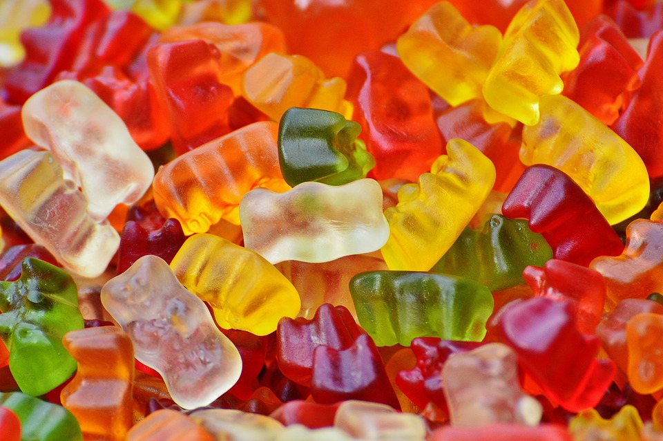

===================
Условна вероватноћа
===================

Понекад се током посматрања случајног експеримента дође до сазнања које може променити вероватноћу посматраног догађаја.

- На пример, уколико погађате исход бацања две коцке, а неко вам кришом каже да су пали исти бројеви, вероватноћа догађаја (пале су две шестице) наравно ће се повећати.
- Тада говоримо о *условној вероватноћи* или вероватноћи да су пале две шестице уз услов да су пали исти бројеви.

*Дефиниција*

- Вероватноћа догађаја Б условно од догађаја А или условна вероватноћа догађаја Б у односу на догађај А је p 

:math:`(Б | А)=\frac{p(АБ)}{p(A)}`.

- Условна вероватноћа догађаја Б уз услов да се догодио догађај A симболички се записује као 

:math:`p (Б | A)`. 

Читамо "вероватноћа догађаја Б уз услов A". 
Размотримо неколико примера, после којих се налазе и задаци за самосталан рад.

**Пример 1**

.. figure:: ../../_images/sp.jpg
   :width: 450px   
   :align: center

Чекајући почетак карташке вечери два пријатеља су се забављала извлачењем карте из шпила од 52 карте. 

- Један од њих је извукао карту.  

*Питање:* Колика је вероватноћа да је извучена десетка? 

- Други је пријатељ погледао извучену карту и рекао да је црна карта с бројем (од 2 до 10 - није ас, жандар, дама или краљ). 

*Питање:* Колика је вероватноћа да је извучена десетка ако се зна да је црна карта с бројем?

**Решење примера**

- Нека је А = {извучена је десетка}, Б = {извучена је црна карта с бројем}. 

- Простор свих елементарних догађаја има 52 елемента и сву су једнако могући, па вероватноћу догађаја А рачунамо према класичној дефиницији p(A) = $\frac{k (A)}{k(Ω)}$ = $\frac{4}{52}$ = $\frac{1}{13}$ 
- Након спознаје да је извучена црна карта с бројем, скуп свих могућих исхода више није скуп Ω, него скуп Б, а повољни су исходи две црне десетке, елементи скупа А ∩ Б.
- Стога је вероватноћа догађаја А уз услов да се десио догађај Б: :math:`p (A | Б) = \frac{k (A ∩ Б)}{k(Б)}$  = \frac{2}{18}  = \frac{1}{9}` 

Задатак 1 за самосталан рад
---------------------------

- Ако је случајан експеримент бацање две коцке, а догађај А = {пале су две шестице} и Б = {пали су исти бројеви}. 

**Пример 2**

.. figure:: ../../_images/od.jpg
   :width: 450px   
   :align: center

- У групи од 30 ученика, 21 ученик има смеђу косу, 19 смеђе очи, а њих 15 има и смеђу косу и смеђе очи.

*Питање:* Колика је вероватноћа да случајно одабрани ученик има смеђе очи ако се зна да има смеђу косу?

*Решење примера*

- Тражимо условну вероватноћу p (A | Б) где је А = {ученик има смеђе очи} и Б = {ученик има смеђу косу}. Прикажи догађаје Венеовим дијаграмом. 

- Дакле, вероватноћа да ученик има смеђе очи уз услов да има смеђу косу је p :math:`(A | Б) = \frac{k (A ∩ Б)}{k(Б)} = \frac{15}{21}  = 0,7143` 

- Нека су општи догађаји Ω, А и Б приказани Венеовим дијаграмом. Потребно је одредити вероватноћу p (A | Б), p (A ∩ Б), p (Б). 
  Постоји ли веза међу њима? Погледајмо.

- Као и у претходном примеру, повољне исходе за A ┃ Б пребројимо у скупу A ∩ Б, а све могуће исходе у скупу Б. Следи:

- :math:`p (A | Б) =  \frac{k (A ∩ Б)}{k(Б)}$ =  \frac{p (A ∩ Б)}{p(Б)}`.

Аналогно се показује да је  :math:`p (Б | A) = \frac{p (A ∩ Б)}{p(A)}`.(*Докажи!*)

*Дефиниција*

- Нека су А и Б произвољни догађаји такви да је p (Б)> 0. 
  Условна вероватноћа догађаја А уз услов да се догодио догађај Б јесте: 
  :math:`p (A | Б) =  \frac{p (A ∩ Б)}{p(Б)}`. Још пишемо :math:`p (A ∩ Б) = p (A | Б) \cdot p(Б)`. 

- Ова формула нам омогућава рачунање условне вероватноће у било којем вероватном простору, не само у класичном, 
  а користећи се обликом  :math:`p (A ∩ Б) =  p (Б) \cdot p (A | Б)` или :math:`p (A ∩ Б) = p (A) \cdot p (Б | A)`
  можемо рачунати вероватноћу просека било која два догађаја А и Б.

Задатак 2 за самосталан рад
---------------------------

Показати да је тачна вредност израза: 

p (A | Б)= 1 - p (A | Б)

Пример 3

Врећица садржи 15 бомбона са укусом јагоде (Ј) и 10 са укусом ментола (М). Марко случајно узима две бомбоне из врећице.
 
а) Прво је извукао бомбону са укусом ментола, а с обзиром на то да је то омиљени укус, запитао се колика је сада вероватноћа да друга бомбона такође има укус ментола? 
 
б) Колика је вероватноћа да ће извући обе бомбоне са укусом ментола?
 
в) Колика је вероватноћа да редослед укуса буде јагода па ментол (ЈМ)?  

*Решење*

Нека је А = {прва извучена бомбона је М-укус ментола}, Б = {друга извучена бомбона је М}

а) Треба израчунати вероватноћу догађаја Б ако знамо да се десио догађај А, односно условну вероватноћу p (Б ┃ A). Након што је прва бомбона извучена, у врећици је остало 24 бомбоне, од којих 9 са укусом ментола, па је p (Б ┃ A) = $\frac{9}{24}$ = 0,375. 

б) У овом случају не знамо да ли се десио догађај А, а занима нас вероватноћа да се догоди и догађај А и догађај Б, односно вероватноћа просека p (A ∩ Б) = p (А) ∙ p (Б ┃ A) = $\frac{10}{25}$ ∙ $\frac{9}{24}$ = 0,15
Напомена: p (A ∩ Б) се може израчунати и класично као p (A ∩ Б) = 0,15. 

ц) И у овом случају можемо рачунати користећи се формулом условне вероватноће што се обично кратко записује: 
p (JM) = $\frac{15}{25}$ (вероватноћа да је прва извучена бомбона од јагоде) ∙ $\frac{10}{24}$ (вероватноћа да је друга извучена бомбона од јагоде) = 0,25

Задатак 3 за самосталан рад
---------------------------

a) Покажи да за три догађаја вреди p (A ∩ Б ∩ Ц) = p (А) ∙ p (Б ┃ A) ∙ p (Ц ┃ A ∩ Б) и формулу уопштити за пресек од n догађаја.

б) Из шпила од 52 карте извлачимо три карте, једну по једну, без враћања. Одредити вероватноћу да је редослед извлачења ас, краљ, ас. 

**Пример 4**

- Према једној анкети, вероватноћа да ће у другом кругу на изборе за градоначелника изаћи мушкарац је 0,55 а жена 0,45. Од мушкараца који су изашли на изборе њих 32% ће гласати за кандидата X, а преостали за кандидата Y. Од жена које су изашле на изборе њих 56% ће гласати за кандидата X. 

.. figure:: ../../_images/stablo5.jpg
   :width: 450px   
   :align: center

а) Описана ситуација се најбоље приказује коришћењем стабла вероватноће

б) Да ли је већа вероватноћа да је случајно одабрани глсач мушкарац који ће дати свој глас кандидату X или жена која ће дати глас кандидату Y?

*Решење*

а) Означимо догађаје и придружимо гранама на стаблу њихове вероватноће.

- М = {гласао је мушкарац} 
- Ж = {глсала је жена}
- X = {X је добио глас}
- Y = {Y је добио глас}

Уочимо да је грани која води до коначног исхода придружена условна вероватноћа.

- На пример, 0,32 (32%) је вероватноћа да је неко глсао за X уз услов да је та особа мушкарац.

б) Множењем означених вероватноћа по гранама долазимо до тражених вероватноћа:

p (M ∩ X) = p (M) ∙ p (X ┃ M) = 0,55 ∙ 0,32 = 0,176 

p (Ж ∩ Y) = 0,45 ∙ 0,44 = 0,198 

- Дакле, већа је вероватноћа да је неки глсач жена која гласа за кандидата Y. 

**Пример 5**

У кутији је 5 белих и 3 црне куглице. Играч случајно узме 2 куглице, једну по једну. Приказати исходе извлачења користећи се стаблом вероватноће и одредити вероватноћу да играч извуче прво белу, а затим црну куглицу ако куглицу након извлачења:

а) враћа куглицу

б) не враћа куглицу

Решење
------

а) с враћањем куглице

б) без враћања куглице

:math:`p (БЦ)=\frac{5}{8} \cdot \frac{3}{8}=\frac{15}{64}`

Где је и зашто настала разлика у решењима ова 2 случаја?

Подсетимо се, догађаји А и Б независни су ако је :math:`p (А ∩ Б) = p (А) \cdot p (Б)`. 

*Чему је једнака условна вероватноћа догађаја А уз услов да се десио догађај Б ако су А и Б независни догађаји?*

Интуитивно јасно, ако догађај А не зависи од тога да ли се десио догађај Б, онда је p (А ┃ Б) = p (А). Доказ је једноставан:

:math:`p (А ┃ Б) = \frac{p (A ∩ Б)}{p(Б)} = p (А) \cdot \frac{p (Б)}{p (Б)} = p(A)`

Задатак 4 за самосталан рад
---------------------------

Из кутије са 5 белих и 3 црне куглице играч узима три куглице, једну по једну. Колика је вероватноћа да 
ће их извући редоследом бела, црна, црна ако куглицу: 

а) враћа

б) не враћа

Питалице и задаци за проверу знања о условној вероватноћи
---------------------------------------------------------

.. quizq::

   .. mchoice:: question342233
      :correct: b
      :answer_a: 1/6
      :answer_b: 1/4
      :answer_c: 1/3
      :answer_d: 1/2
      :feedback_a: Нетачно
      :feedback_b: Тачно
      :feedback_c: Нетачно
      :feedback_d: Нетачно
      
      Колика је вероватноћа да од 32 карте за игру извучемо или каро (коцка) или аса?

.. quizq::

   .. mchoice:: question345213
      :correct: c
      :answer_a: 1/6
      :answer_b: 1/4
      :answer_c: 1/3
      :answer_d: 1/2
      :feedback_a: Нетачно
      :feedback_b: Нетачно
      :feedback_c: Тачно
      :feedback_d: Нетачно
      
      Колика је вероватноћа да ће при бацању коцкице пасти број мањи од 3? 

.. quizq::

   .. mchoice:: question3457811290
      :correct: b
      :answer_a: 1/4
      :answer_b: 2/3
      :answer_c: 1/6
      :answer_d: 2/5
      :feedback_a: Нетачно
      :feedback_b: Тачно
      :feedback_c: Нетачно
      :feedback_d: Нетачно
      
      Бачене су две коцкице за игру и добијен је збир поена 10. Колика је вероватноћа догађаја да је пала бар једна шестица? 

.. quizq::

   .. mchoice:: question34578119898
      :correct: a
      :answer_a: 3/10
      :answer_b: 5/8
      :answer_c: 4/2
      :answer_d: 9/5
      :feedback_a: Тачно
      :feedback_b: Нетачно
      :feedback_c: Нетачно
      :feedback_d: Нетачно
      
      У кутији се налази 10 куглица (7 белих и 3 црне). Извлаче се, без враћања, куглице једна за другом. Колика је вероватноћа догађаја да друга извучена куглица буде црна? 

.. quizq::

   .. mchoice:: question34578777
      :correct: b
      :answer_a: 0.04
      :answer_b: 0,09
      :answer_c: 0,10
      :answer_d: 0,08
      :feedback_a: Нетачно
      :feedback_b: Тачно
      :feedback_c: Нетачно
      :feedback_d: Нетачно
      
      У контејнеру се налази 12 производа, од којих је 8 стандардних. Радник бира насумице два производа, прво један, затим други. Одредити вероватноћу да су оба производа нестандардна, а потом изабери тачан одговор.

Занимљив видео клип о Бернулијевом доприносу вероватноћи

.. ytpopup:: evyT3_8Dnhs
    :width: 935
    :height: 600
    :align: center
