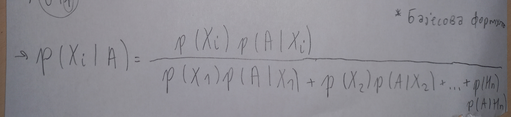

===============================================
Бајесова формула (формула вероватноћа хипотеза)
===============================================

Бајесова формула и њена примена су од великог значаја и примене у свету око 
нас тако да је разумевање ове лекције јако битно за разумевање сржи вероватноће. 

.. figure:: ../../_images/b.png
   :width: 450px   
   :align: center

**Пример 1**

Петар иде на посао возом, бициклом или аутомобилом. Ако иде возом, касни у 5% случајева, бициклом у 2%, а аутомобилом у 10% случајева. 

Бициклом иде три пута чешће него аутомобилом, а возом 4 пута чешће него аутомобилом. Петар је једног дана закаснио на посао. 

Колика је вероватноћа да је тај дан ишао на посао аутомобилом?

**Решење**

Вероватноћа хипотезе да Петар иде аутомобилом нам је позната, међутим након што смо сазнали да је Петар закаснио, та се вероватноћа мења. Нас занима условна вероватноћа да је Петар ишао аутомобилом ако знамо да је закаснио.

Након цртања стабла вероватноће увиди да је повољан исход АК, а могући су сви исходи у којима Петар касни (на слици су њихове гране означене плавом). Стога бисмо тражену вероватноћу могли израчунати као

- :math:`p (А | К) = \frac{0,0125}{0,0145} = \frac{5}{18} = 0,2778`.

Како бисмо показали да је заиста тако, доказаћемо следећу формулу: 

.. figure:: ../../_images/stablo3.jpg
   :width: 450px   
   :align: center

*Нека се догађаји $X_{1}$, $X_{2}$, ... $X_{n}$ међусобно искључују и Ω = $X_{1}$ ∪ $X_{2}$ ∪ ... ∪ $X_{n}$. За произвољни догађај А, p (А)>0 и за све i = 1,2, ... n вреди Бајесова формула: p ($X_{i}$ ┃ А)* 

*Доказ* 

Догађаји :math:`X_{1}`, :math:`X_{2}`, ... :math:`X_{n}` су хипотезе па према формули потпуне вероватноће вреди 

:math:`p (А) = p (А | X_{1}) + p (X_{2}) \cdot p (А | X_{2}) + ... + (p $X_{n}) \cdot p (А | X_{n})`. 

Слика приказује Бајесову формулу или теорему вероватноће хипотеза у општем облику, који се даље може упростити применом правила потпуне вероватноће.

**Пример 2**

.. figure:: ../../_images/crp.jpg
   :width: 450px   
   :align: center

У корпи је 8 белих и 10 црних чарапа. Приликом поспремања Тин је открио да једна чарапа недостаје. 
Након тога на случајан начин узима две чарапе и обе су беле. 

*Пиатање:* Колика је верованоћа да је изгубљена чарапа беле боје?

*Решење*

Означимо хипотезе 

- :math:`X_{1}= {изгубљена је бела чарапа}` 
- :math:`X_{2} = {изгубљена је црна чарапа}`  
- а догађај А = {извучене су две беле чарапе}

Треба израчунати :math:`p (X_{1} | А)` 

*Задатак можете завршити за домаћи :)*

Задатак 1 за самосталан рад
---------------------------

- Користећи се стаблом вероватноће, решити пример 8 у случају да у корпи недостају 2 чарапе, односно колика је вероватноћа да су изгубљене две беле чарапе ако се зна да су након тога извучене две беле чарапе.

**Пример 2**

Вратили сте се са путовања из земље у којој влада епидемија неке заразне болести и 1,5% популације је заражено. 
Иако немате симптоме, лекар вас је одлучио тестирати. Поузданост теста је 95%, што значи да је резултат 
теста позитиван код 95% заражених или негативан код 95% незаражених. 

Ваш тест је позитиван. 

Да ли вас је лекар с разлогом одлучио тестирати? 

Колика је вероватноћа да сте заиста заражени уколико је ваш тест позитиван? 
Ваш се пријатељ из исте те земље вратио 3 месеца касније, такође без симптома у тренутку 
када је већ 45% тамошње популације било заражено. 

Тестиран је истим тестом и тест је био ппозитиван. Има ли он разлога за бригу?

*Решење*

Нацртајмо стабло вероватноће и означимо следеће догађаје и вероватноће.

- З = {особа је заражена} 
- Б ={особа није заражена}
-  +=  {тест је позитиван}
- -= {тест је негативан}

.. figure:: ../../_images/stablo2.jpg
   :width: 450px   
   :align: center

Случајно одабран особа је заражена с вероватноћом p (Б) = 0,985. 

Из поузданости теста следи: p (+ | З) = 0,95 , p (+ | Б) = 0,05 , p (- | З)= 0,05 , p (- | Б) = 0,95.
Вероватноћа хипотезе З уз услов да је тест позитиван рачунамо користећи се нацртаним стаблом:

- :math:`p (З | +) = \frac{0,01425}{0,01425 + 0,04925} = 0,22` (приближна вредност)

Дакле, тест прогласи позитивнима око 22% особа које су заражене, а чак 78% оних које нису заражене. 
Стога је вероватноћа да сте заражени релативно мала, без обзира на позитиван тест. 

За вашег пријатеља ситуација је другачија јер  

- :math:`p (З | +) = \frac{0,45 \cdot 0,95}{0,45 \cdot 0,95 + 0,55 \cdot 0,05} = 0,94` (приближна вредност)

Дакле, вероватноћа да је ваш пријатељ заражен је много већа јер иако се ради о истом тесту? 

*Продискутујте зашто је дошло до тако велике разлике?*

Из претходног примера је јасно да уз малу учесталост болести позитиван резултат тестирања не значи и болест за тестирану особу. 

*Стога у наредним задацима, уз ознаке као у примеру 5, истражи и продискутуј везу између вероватноће p (З | +), p (З), p (+ | З).*

Нека је поузданост теста 99%. Истражи зависност броја  p (З | +) од процента заражених у целој популацији, ако је тај проценат 0,8% , 3% , 10% , 30% , z%. 

*Колико најмање људи треба бити заражено да би масовно тестирање имало смисла?*

- Како поузданост теста утиче на претходна разматрања, односно на p (З | +)? Зависи ли поузданост теста од броја заражених у целој популацији?

Занимљивост
~~~~~~~~~~~

За вероватноћу да је резултат теста позитиван ако је особа заражена или p (+ | З) прецизније се употребљава назив *сензитивност* теста, 
а назив *специфичност* теста употребљава се за вероватноћу да је резултат теста негативан ако особа није заражена или p (- | З). Заједничким именом се називају *поузданостима* теста. У примеру 9 је узето да су вероватноће једнаке, иако у пракси најчешће нису.

Питалице и задаци за проверу знања о Бајесовој формули 
------------------------------------------------------

.. quizq:: 

   .. mchoice:: question390
      :multiple_answers:
      :correct: b,c
      :answer_a: у случају са два догађаја А и Б, важи само када је остварен догађај Б
      :answer_b: теорема која се користи приликом рачуна са условном вероватноћом
      :answer_c: у случају са два догађаја А и Б, важи само када је остварен догађај А
      :answer_d: даје нам прецизне податке о веродостојности неког теста 
      :feedback_a: Нетачно
      :feedback_b: Тачно
      :feedback_c: Нетачно
      :feedback_d: Тачно
      
      Шта говори Бајесова формула о вероватноћи? 

.. quizq:: 

   .. mchoice:: question3909
      :correct: a
      :answer_a: 0,21
      :answer_b: 0,89
      :answer_c: 1,23
      :answer_d: 4,56
      :feedback_a: Тачно
      :feedback_b: Нетачно
      :feedback_c: Нетачно
      :feedback_d: Нетачно
      
      Цела производња у фабрици се одвија на три машине. Три машине чине редом 20%, 30% и 50% фабричке производње. Удeо произведеног шкарта (неисправних производа) за прву машину износи 5%; 3% за другу машину; и 1% за трећу машину. Ако је случајно одабран производ неисправн, која је вероватноћа да је произведен од стране треће машине?

.. quizq:: 

   .. mchoice:: question39094321
      :correct: a
      :answer_a: 0,53 
      :answer_b: 0,94
      :answer_c: 1,64
      :answer_d: 5,28
      :feedback_a: Тачно
      :feedback_b: Нетачно
      :feedback_c: Нетачно
      :feedback_d: Нетачно
      
      У кутији А налазе се 9 листића нумерисаних бројевима од 1 до 9, а у кутији Б налази се 5 листића нумерисаних бројевима од 1 до 5. Бирамо кутију насумице и из ње извлачимо један листић. Ако је број на листићу паран, израчунати колика је вероватноћа да је листић извађен из кутије А.

.. quizq:: 

   .. mchoice:: question3909432123
      :correct: a
      :answer_a: 0,268 
      :answer_b: 2,321
      :answer_c: 3,982
      :answer_d: 1,763
      :feedback_a: Тачно
      :feedback_b: Нетачно
      :feedback_c: Нетачно
      :feedback_d: Нетачно
      
      Војник погађа мету са вероватноћом 0,8 (добар стрелац). Колика је вероватноћа да ће из 10 независних покушаја мету погодити тачно 9 пута? 

Видео клип уколико желиш да сазнаш нешто више о Бајесовом доприносу вероватноћи

.. ytpopup:: OByl4RJxnKA
    :width: 935
    :height: 600
    :align: center
